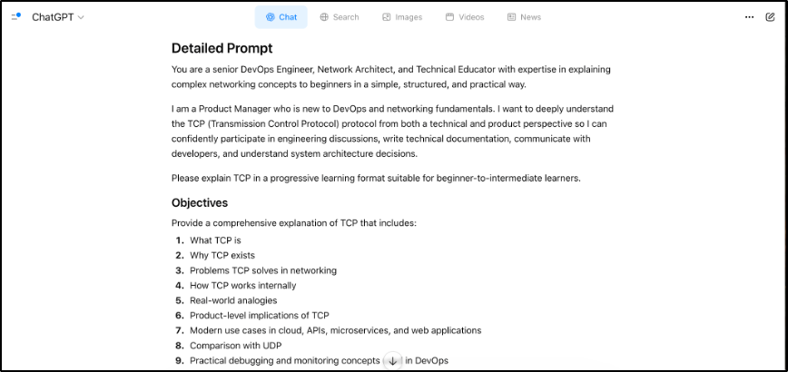
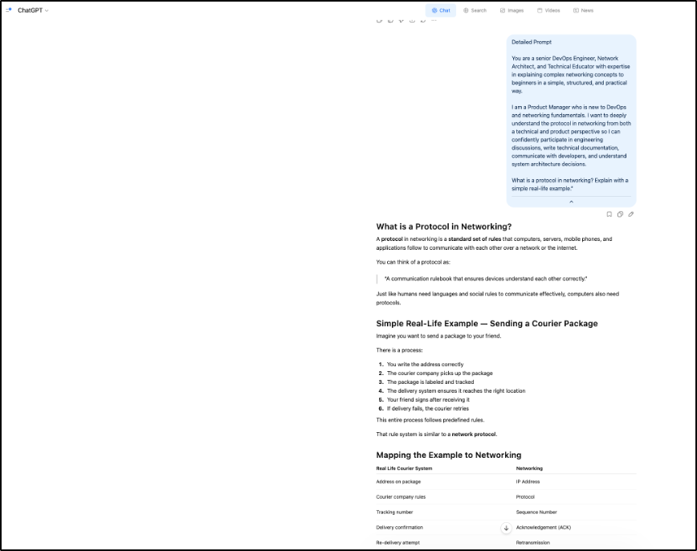
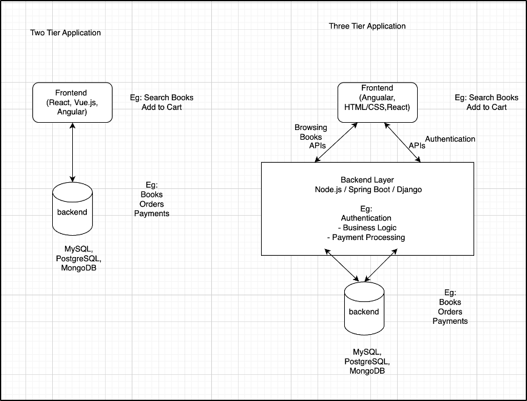
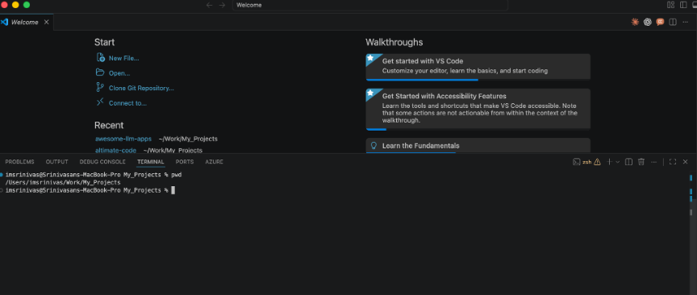
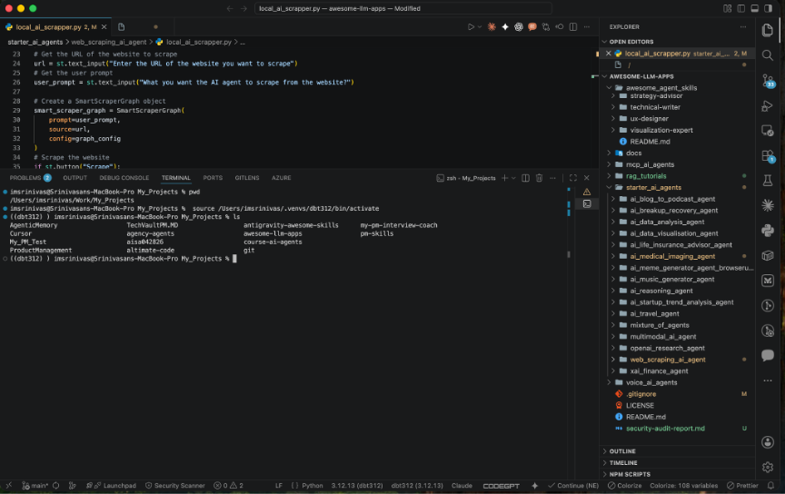

# Week 00 - Internet and Networking

Part of the DevOps Micro Internship (DMI) Cohort 3 with Agentic AI

---

# 🧑‍💻 Task 1: Using ChatGPT as Your Learning Assistant

## Scenario

You're new to DevOps and will frequently encounter technical questions. ChatGPT can be your learning companion.

## Your Task

Write a clear ChatGPT prompt to help you understand:

> "What is a protocol in networking? Explain with a simple real-life example."

Take a screenshot of your interaction showing:

* Your detailed prompt (with clear expectations)
* ChatGPT's simplified response with an example

## Screenshot

Save your screenshot in the `screenshots` folder and update the file name below.





---

## What I Learned (2–3 lines)

I learned how to use ChatGPT as a learning assistant to understand technical concepts in a simple and structured way. I’ve also learned and executed different prompt frameworks(CoT etc) for searching in the ChatGPT.

---

# 🌐 Task 2: Internet and Networking

## Scenario

Your friend is launching an online bookstore named **EpicReads**.

He asked you to explain how users globally can access his website hosted in Finland.

## Your Task

Write a short explanation (**100–150 words**) that includes:

* Packet Switching
* IP Address
* TCP/IP
* HTTP/HTTPS

💡 **Tip:** You may use ChatGPT (as demonstrated in Task 1) to refine your explanation.

## Answer

EpicReads website is hosted on a computer server in Finland. Even though the server is far away, people from India, the USA, or anywhere in the world can still open the website using the internet.

Every website server has a unique number called an IP Address, similar to a home address. This helps the internet find the correct server where EpicReads is hosted.

When someone opens the website, the information does not travel as one big file. Instead, it is broken into small pieces called packets. This process is called Packet Switching. These packets travel through different internet routes and are joined back together on the user’s device.

The internet uses TCP/IP protocols to move this data reliably:

IP finds the correct destination
TCP ensures all packets arrive correctly and in order

The browser communicates with the website using HTTP/HTTPS:

HTTP loads webpages
HTTPS securely encrypts the data

---

# 🏗️ Task 3: Application Architecture & Stack

## Scenario

EpicReads bookstore has two application versions:

### Two-Tier Application

* Frontend
* Database

### Three-Tier Application

* Frontend
* Backend
* Database

## Your Task

* Draw simple diagrams (hand-drawn or tool-based such as draw.io)
* Label each layer clearly
* List at least two common technologies or tools used for each layer
* Submit a screenshot or photo clearly showing your own drawing

## Diagram Screenshot / Photo



---

## Technologies Used

### Frontend

* React
* Vue JS
* Angular

### Backend

* Spring Boot
* Django
* Node.JS

### Database

* MySQL
* PostgreSQL
* MongoDB

---

# 🌍 Task 4: Domain Name & DNS (Basic Concepts)

## Scenario

Your friend's bookstore **EpicReads** is currently accessible through:

```text
52.172.142.222:3000
```

He purchased the domain:

```text
epicreads.com
```

## Your Task

In **50–100 words**, explain in your own words:

1. What is DNS (Domain Name System)?
2. Which DNS record type should be used to connect the domain to the given IP, and why?

## Answer

DNS (Domain Name System) is like the internet’s phonebook.
It converts easy-to-remember domain names such as epicreads.com into IP addresses like 52.172.142.222, which computers use to locate servers on the internet.

To connect the domain epicreads.com to the given IP address, an A Record should be used.

An A Record maps a domain name directly to an IPv4 address, allowing users to access the EpicReads website through the domain name instead of typing the server IP and port manually.

---

# 💻 Task 5: Visual Studio Code Setup (Hands-on)

## Your Task

Install Visual Studio Code (if not already installed).

Take a screenshot of your VS Code environment showing:

* Terminal open inside VS Code
* Running a basic command:

### Windows

```powershell
dir
```

### Linux / macOS

```bash
pwd
ls
```

* Your selected VS Code theme clearly visible

⚠️ **Important:** The screenshot must show your username or another identifiable detail to confirm it is your environment.

## Screenshot





---

# 🔗 Task 6: Publish Your Assignment as a LinkedIn Post

## Objective

Publishing on LinkedIn helps you:

* Build your professional online presence
* Reinforce your learning
* Document your DevOps journey publicly

## Your Task

Summarize your answers from Tasks 1–5 into a LinkedIn post.

Clearly structure your post into the following sections:

* ChatGPT
* Internet & Networking
* App Architecture
* DNS
* VS Code Setup

Add the following credit note at the end of your post:

> **P.S. This post is part of the DevOps Micro Internship (DMI) with Agentic AI — Cohort 3 — by Pravin Mishra. My graded progress is public: https://dmi.pravinmishra.com/s/YOUR-GITHUB-USERNAME.html · Start your DevOps journey: https://dmi.pravinmishra.com/?utm_source=student&utm_medium=ps-linkedin&utm_campaign=cohort3**

---

## LinkedIn Post URL

Paste your LinkedIn post URL here:

```text
https://www.linkedin.com/posts/imsrinivasram_devops-cloudengineering-techwriting-share-7458500177558122496-BoT9?utm_source=share&utm_medium=member_desktop&rcm=ACoAAAPiUQ4BH6sxKAUSmrEMd9H6ZwrpEEVDZuE

https://medium.com/@iamsrinivas.raman/why-this-product-manager-is-learning-devops-70275610e210
```

---

## LinkedIn Post Backup Copy

Paste the full text of your LinkedIn post here:

I'm documenting my learning journey through the DevOps Micro Internship Cohort 3.

In this article, I break down:

- ChatGPT & Prompt Engineering
- Internet & Networking
- Application Architecture
- DNS
- VS Code Setup

Whether you're getting into DevOps, managing technical teams, or just tired of nodding along when engineers talk about infrastructure, this is a good starting point.

Read the full article: https://lnkd.in/gyAivVSh

P.S. This is part of the FREE DevOps Micro Internship (DMI) Cohort 3 by Pravin Mishra.
Want to join? Start here: Discord Community

#DevOps #CloudEngineering #TechWriting #DMICohort3 #DevOpsInternship

---

# Reflection – Week 0

### What did you find easy?

Since already exposed these concepts, this week assignment was easy and been exposed to the chatGPT usage and hands on experience with VS code, these assignments are easy.

---

### What was difficult?

Taking time to go through all the details and ensuring everything is in tact and meets all the criteria for submissions.

---

### What will you improve next week?

Next week, I will focus on improving my time management by allocating dedicated blocks for reviewing all assignment criteria and ensuring every submission detail is accurate on the first attempt. I will also dedicate more focused study time to the core technical concepts introduced in the next module to move beyond foundational knowledge and build a deeper practical understanding.

---

## 📌 About DMI & CloudAdvisory

DevOps Micro Internship (DMI) is a project-based DevOps program run by Pravin Mishra (The CloudAdvisory) focused on real-world execution, systems thinking, and career readiness.

It helps learners build strong DevOps foundations with hands-on experience.

## 📌 Resources

- 🌐 **DMI Official Website:** https://pravinmishra.com/dmi  
- 🎓 **DevOps for Beginners (Udemy):** https://www.udemy.com/course/devops-for-beginners-docker-k8s-cloud-cicd-4-projects/  
- 🎓 **Ultimate Agentic AI DevOps with Clude Code** https://www.udemy.com/course/ultimate-agentic-ai-devops-with-claude-code/?referralCode=448389767BC96284087B
- 🎓 **DevOps with Claude Code: Terraform, EKS, ArgoCD & Helm** https://www.udemy.com/course/devops-with-claude-code-terraform-eks-argocd-helm/?referralCode=1C5B734505D65A010FA3
- ▶️ **YouTube Playlist (DMI Cohort 3):** https://www.youtube.com/playlist?list=PLFeSNDtI4Cho  
- 🔗 **Pravin Mishra (LinkedIn):** https://www.linkedin.com/in/pravin-mishra-aws-trainer/  
- 🏢 **CloudAdvisory (LinkedIn):** https://www.linkedin.com/company/thecloudadvisory/

---

*This submission is part of DevOps Micro Internship (DMI) Cohort 3 — Agentic AI Track*