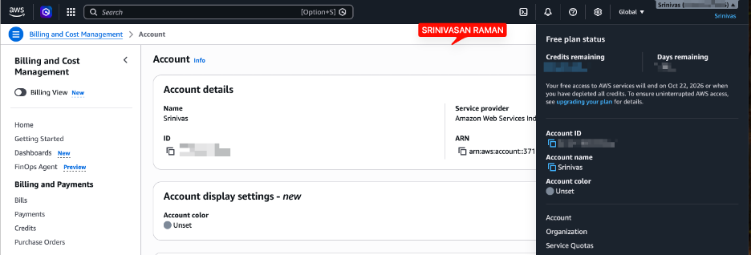

# Assignment 1 — AWS Free Tier Account Setup (EpicReads Cloud Onboarding)

Part of the DevOps Micro Internship (DMI) Cohort 3 with Agentic AI

---

## Purpose

In this assignment, you will create and verify an AWS Free Tier account as part of onboarding EpicReads — an online bookstore moving to the cloud. You will demonstrate an understanding of AWS fundamentals, Free Tier services, and account setup by answering conceptual questions and capturing proof of a working AWS Console login.

---

# Task 1 — Understanding AWS & Free Tier

## Goal

Demonstrate understanding of AWS basics and Free Tier usage by answering the following questions in your own words (3–4 lines each).

### Answers

#### Question 1 — What is an AWS account, and why do you need it at this stage?

An AWS account is the entry point into the cloud and login and billing profile that lets to provision and manage real infrastructure like EC2 instances, S3 buckets, and ECR repositories.
For the DMI batch, Tutorials and docs give you theory, but DevOps is a hands-on craft. The only way to build real skill is to work in the same environment which we use on the job.
The Free Tier makes this accessible. This helps to deploy websites, spin up virtual machines, configure databases, and set up security protocols — all with minimal to no cost.

---

#### Question 2 — What is AWS Free Tier, and how long does it last?

When I signed up for AWS, I got access to the Free Tier — which basically means I can explore and build on real cloud infrastructure without immediately worrying about a bill.
Since I created my account after July 15, 2025, I'm on the new Free Plan. I got $100 in credits at signup, and I can earn up to another $100 by completing guided activities. The plan runs for six months, or until I use up the credits — whichever comes first. If that happens, I get a 90-day window to either upgrade to a paid plan or pull my data before the account closes.
On top of the credits, there are Always Free services that don't expire as long as I stay within the monthly usage limits. Those are useful for things I want to keep running without eating into my credits.
If you signed up before July 15, 2025, your experience is slightly different — you're on the Legacy Free Tier, which gives you 12 months of free usage on services like EC2, S3, RDS, and CloudFront. You also get the Always Free services, same as everyone else.
Either way, the point is the same — you get enough runway to build real things and figure out how AWS works before any real money is involved.

---

#### Question 3 — Name three AWS Free Tier services and their free usage limits.

Amazon RDS (Relational Database Service) is AWS's managed database service. Instead of setting up and maintaining a database server yourself, AWS handles it as below.
•	Runs relational databases in the cloud — MySQL, PostgreSQL, MariaDB, Oracle, SQL Server, and Amazon Aurora
•	Handles backups, patching, scaling, and failover automatically
•	This just connects to it like any other database
Amazon S3 is where I store files in the cloud — images, backups, static websites, anything really. On the Free Tier, I get 5GB of storage, 20,000 GET requests, and 2,000 PUT requests per month.
Amazon EC2 is essentially a virtual machine running in the cloud. Instead of a physical server, I get a cloud-hosted machine I can run applications on. The Free Tier gives me 750 hours a month on a t2.micro or t3.micro instance — which is enough to keep one small server running around the clock for a full month. Good for learning, testing, or hosting something simple.

---

# Task 2 — Create AWS Free Tier Account

## Goal

Create a valid AWS Free Tier account and sign in to the AWS Management Console.

> No screenshots required for this task. Completion is verified through Task 3.

---

# Task 3 — Verify AWS Account

## Goal

Confirm that your AWS account setup is complete by navigating to the Account section and capturing proof.

### Evidence

#### Screenshot 1 — AWS Account page showing account name (email may be blurred)

---

# Submission Instructions

- Add all required screenshots in your GitHub repository submission
- Full name must be visible in required screenshots
- Do not expose sensitive information (keys, passwords, account IDs)

---

# Completion Checklist

- [ ] Task 1 answers written in own words
- [ ] AWS Free Tier account created successfully
- [ ] Signed in to AWS Management Console
- [ ] Screenshot of AWS Account page captured (full name visible, no sensitive data)
- [ ] All required screenshots added to repository

---

## 📌 About DMI & CloudAdvisory

DevOps Micro Internship (DMI) is a project-based DevOps program run by Pravin Mishra (The CloudAdvisory) focused on real-world execution, systems thinking, and career readiness.

It helps learners build strong DevOps foundations with hands-on experience.

---

## 📌 Resources

- 🌐 DMI Official Website: https://dmi.pravinmishra.com?utm_source=github&utm_medium=readme  
- 🎓 University: https://university.pravinmishra.com?utm_source=github&utm_medium=readme  
- 💬 Discord Community: https://discord.pravinmishra.com?utm_source=github&utm_medium=readme  
- 📝 Blog: https://dmi.pravinmishra.com/blog?utm_source=github&utm_medium=readme  
- ▶️ YouTube Playlist: https://www.youtube.com/playlist?list=PLFeSNDtI4Cho  
- 🔗 Pravin Mishra (LinkedIn): https://www.linkedin.com/in/pravin-mishra-aws-trainer/  
- 🏢 CloudAdvisory (LinkedIn): https://www.linkedin.com/company/thecloudadvisory/

---

*This submission is part of DevOps Micro Internship (DMI) Cohort 3 — Agentic AI Track.*