# Assignment 3 — Production Maintenance Drill (OPS Checklist)

Part of the DevOps Micro Internship (DMI) Cohort 3 with Agentic AI

---

## Purpose

In this assignment, you will treat your already deployed React application (on Ubuntu VM with Nginx) as a live production system. You will perform structured operational checks covering network validation, service health, log analysis, resource monitoring, configuration verification, and incident simulation with recovery — mirroring real on-call DevOps responsibilities.

---

# Task 1 — Server Access & Networking Validation

## Goal

Verify that the deployed React application is reachable from the browser and confirm basic network connectivity of the Ubuntu VM.

### Evidence

#### Screenshot 1 — Browser showing the React app with your Full Name visible on the UI

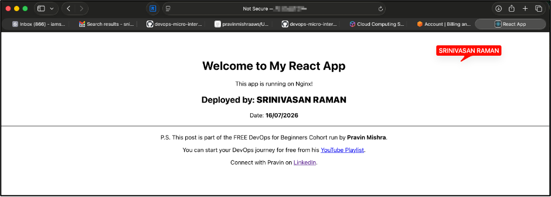

---

#### Screenshot 2 — Output of `ip a`

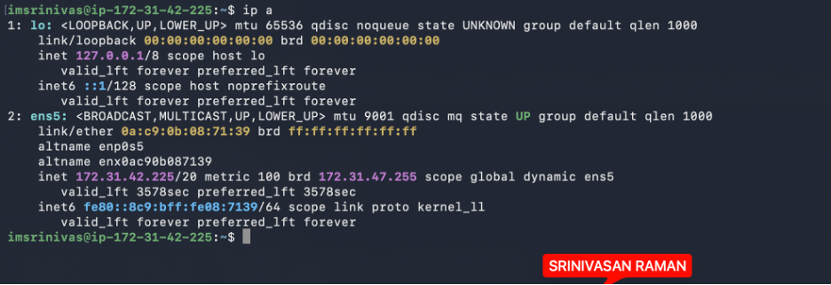

---

#### Screenshot 3 — Output of `sudo ss -tulpen`

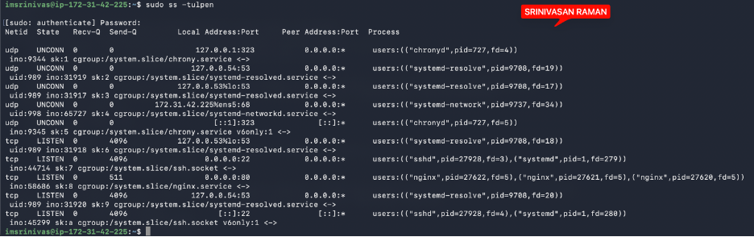

---

#### Screenshot 4 — Output of `sudo ufw status`

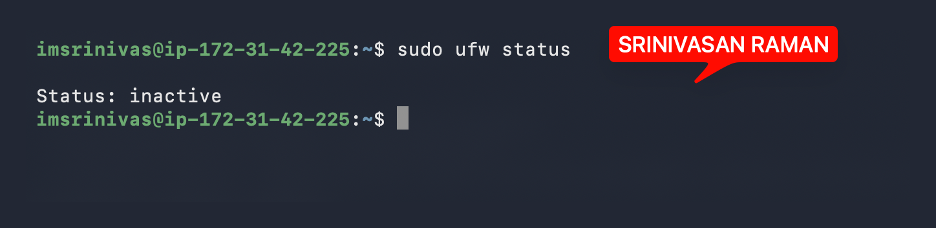

---

### Notes

Answer the following in your own words:

**1. What proves Nginx is listening on 0.0.0.0:80?**

When I ran sudo ss -tulpen, I could see Nginx listed against port 80. The 0.0.0.0 next to it means Nginx isn't just listening locally — it's open to all network interfaces, which means anyone on the internet can reach it over HTTP. The process name nginx confirms it's specifically Nginx holding that port, not something else running in the background.

---

**2. What proves SSH is active on port 22?**

When I ran sudo ss -tulpen it shows sshd listening on port 22, again across all interfaces (0.0.0.0). This is what makes remote login possible — it's the reason I can connect to the server from my local machine using ssh ubuntu@<public-ip>.

---

**3. Did you find any unexpected open ports? Explain briefly.**

Nothing unexpected showed up. Besides Nginx on port 80 and SSH on port 22, the only other services running were chronyd (for time sync) and systemd-resolved (for DNS) — both bound to loopback addresses, meaning they're only accessible from within the server itself, not from the outside. So the only two services exposed to the internet are exactly the ones I intended: the web server and SSH.

---

# Task 2 — Service Health & Systemd Validation (Nginx)

## Goal

Verify that Nginx is properly installed, running, enabled at boot, and safely configured.

### Evidence

#### Screenshot 1 — Output of `systemctl status nginx --no-pager`

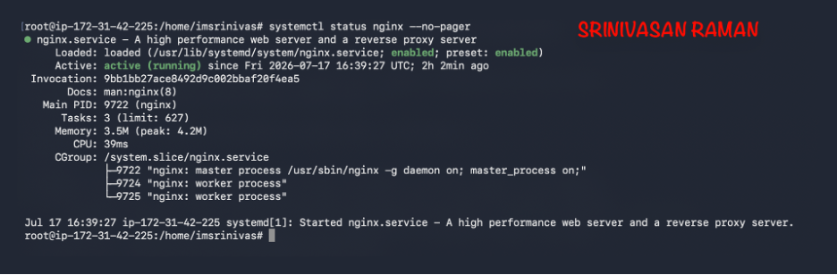

---

#### Screenshot 2 — Output of `sudo nginx -t`

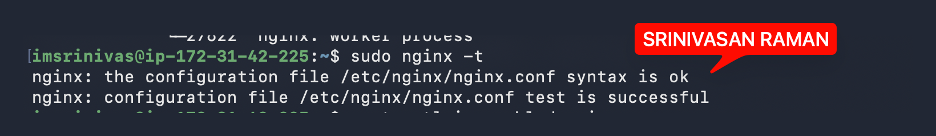

---

#### Screenshot 3 — Output of `sudo ss -lptn '( sport = :80 )'`

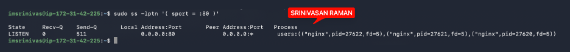

---

### Notes

Answer the following in your own words:

**1. What happens if Nginx fails to restart in production?**

If Nginx goes down, the website goes down with it. Since Nginx is the only thing serving traffic on port 80, anyone trying to visit the site would just get a connection error — nothing would be there to respond. The risk gets bigger during deployments or config changes, because if something breaks and Nginx fails to restart, the site stays down until I manually go in and fix it. There's no automatic recovery.

---

**2. What's your basic rollback plan?**

Before touching any config, I always run sudo nginx -t first — it checks the syntax and catches mistakes before they cause a restart to fail.
If a restart does fail, the first thing I do is check what went wrong using systemctl status nginx --no-pager and sudo journalctl -u nginx --no-pager -n 50 to read the exact error.
If the issue is a bad config change, the fix is simple — revert the file back to the previous working version and try again. That's why I keep a backup copy of the config before making any changes. If something breaks, I don't have to debug under pressure — I just swap the file back and restart.

---

# Task 3 — Logs & Request Trace

## Goal

Verify real traffic flow and analyze logs to understand system behavior and errors.

### Evidence

#### Screenshot 1 — Output of `sudo tail -n 30 /var/log/nginx/access.log`

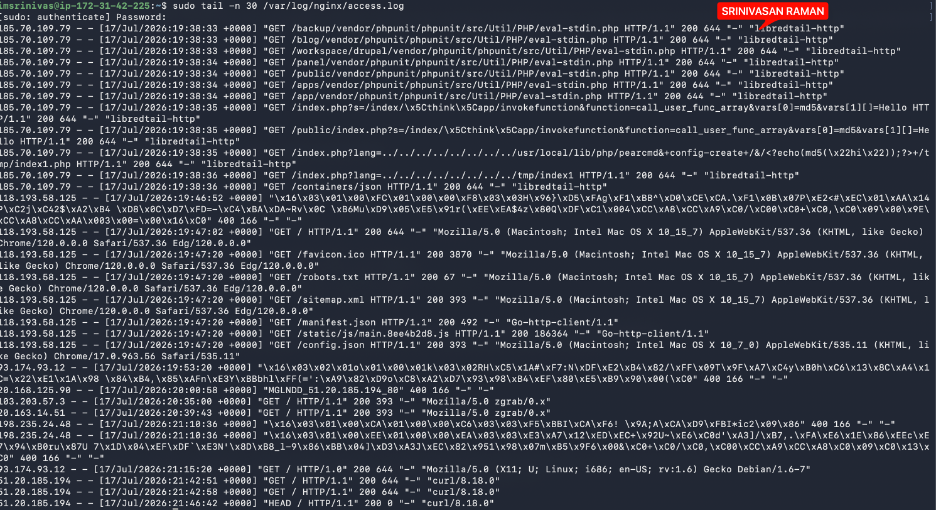

---

#### Screenshot 2 — Output of `sudo tail -n 30 /var/log/nginx/error.log`

---

#### Screenshot 3 — Output of `sudo journalctl -u nginx --no-pager -n 50`

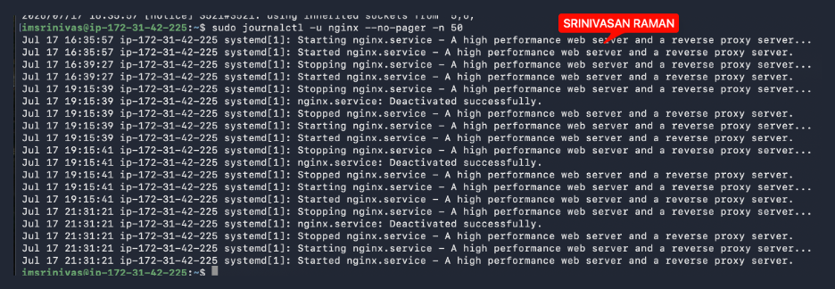

---

### Notes

Answer the following in your own words:

**1. Were there any errors in the logs?**

- If yes, mention 1–2 example error lines from the logs and explain what each one means in simple terms.
- If no, explain what it means if the error log is empty or shows no recent errors during your check.

That's a clean error log — nothing to worry about.
The single line:
[notice] using inherited sockets from "5;6;"
This just means Nginx restarted and picked up the existing open connections (port 80) from its previous process without dropping them. It's normal behavior during a reload or restart — Nginx hands off active sockets to the new worker process so there's no interruption in traffic.
No errors, no warnings. The server is running clean.
The journalctl entries show only clean Started, Stopped and Deactivated successfully events — no failed or exited with status lines anywhere.

---

**2. If there were no errors, what does that indicate about the system?**

The error log is empty and journalctl shows no issues — which means Nginx hasn't run into any errors, misconfigurations, or failed restarts during this period. That's a good sign. But it only tells me what happened in the window I checked, not what comes next. Config changes, traffic spikes, or shifting system conditions could introduce new problems at any point. So this isn't a one-time check — it's something I need to revisit regularly.

---

**3. Based on the access logs, were your curl requests visible in the log entries? What does that prove about traffic flow?**

Yes. When I ran curl, it showed up in the access log as a GET / request from my own public IP, returning a 200 status with curl/8.18.0 as the user agent. That single log line confirms the entire flow is working — the request went out, hit Nginx, got served correctly, and was logged. Nothing broken anywhere in the chain

---

# Task 4 — System Resource Health Check (Capacity Red Flags)

## Goal

Assess server capacity and detect potential performance or failure risks.

### Evidence

#### Screenshot 1 — Output of `uptime`

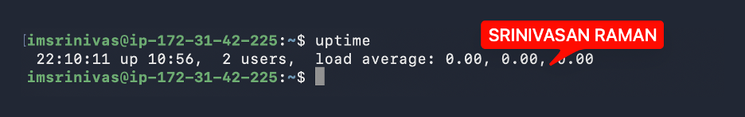

---

#### Screenshot 2 — Output of `free -h`

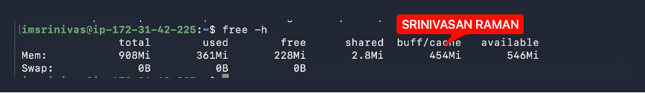

---

#### Screenshot 3 — Output of `df -h`

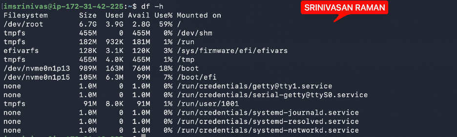

---

#### Screenshot 4 — Output of `sudo du -sh /var/* | sort -h`

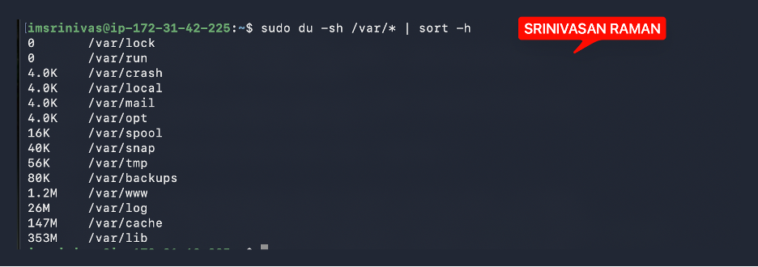

---

### Notes

Answer the following in your own words:

**1. Which resource looks most critical right now? (CPU/load, memory, or disk) Explain why.**

Right now, none of the three resources are showing any red flags — CPU is barely doing anything, memory has plenty of headroom with no swap usage, and disk is sitting at 59%. If I had to pick one to watch most closely as the server grows, it would be disk. Unlike CPU or memory, which usually make themselves known through visible slowness, disk just quietly fills up over time — logs accumulate, package caches grow — and by the time it becomes a problem, it's already critical.

---

**2. What happens if disk becomes 100% full in a production server?**

When disk space runs out, logs stop recording — which is the worst time for that to happen, usually right in the middle of an incident when you need them most. Build tools and package managers can crash because they have nowhere to write temp files. If a database were running locally, it could start refusing writes or corrupting data. In extreme cases, even basic things like SSH login can stop working because the OS itself needs a small amount of free space just to function.

---

# Task 5 — Configuration & Deployment Verification

## Goal

Ensure the correct React build is deployed and Nginx is serving it properly.

### Evidence

#### Screenshot 1 — Output of `ls -lah /var/www/html | head -n 20`

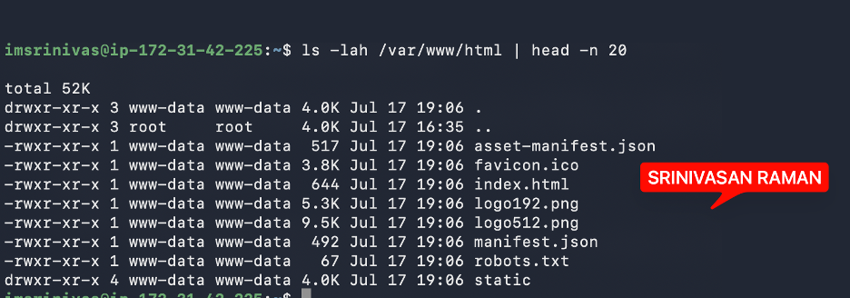

---

#### Screenshot 2 — Output of `grep -R "Deployed by" -n /var/www/html 2>/dev/null | head`

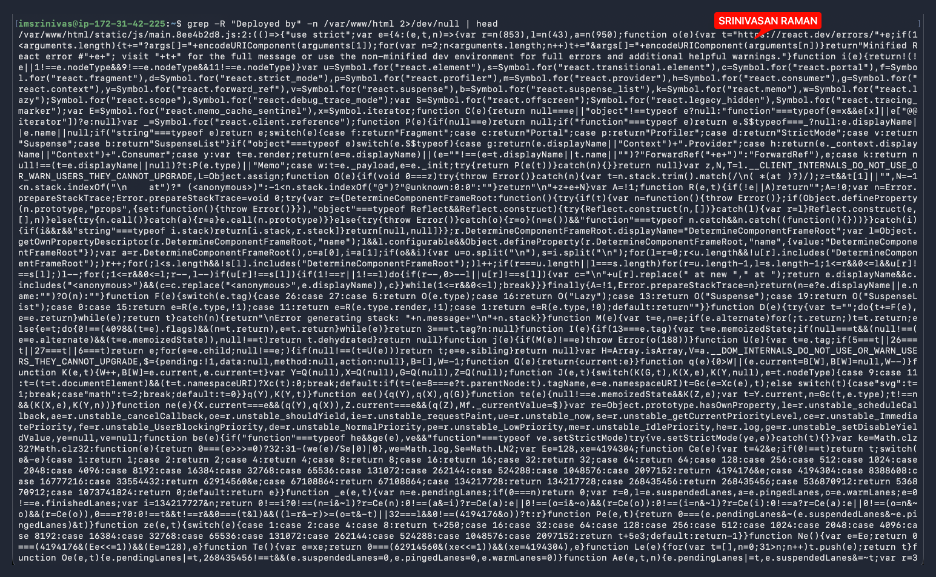

---

#### Screenshot 3 — Output of `grep -n "try_files" /etc/nginx/sites-available/default`

---

### Notes

Answer the following in your own words:

**1. How do you confirm that the correct version of the application is deployed?**

I verified the deployment in a few different ways.
First, I ran ls -lah /var/www/html to confirm the build files were actually there — index.html, the static/ folder with the compiled JS and CSS bundles, all owned by www-data, which is the user Nginx runs as.
Then I used grep -R "Deployed by" to check that my specific change made it into the live build. It came back in the compiled JavaScript bundle, which confirmed this wasn't a stale or generic build — it was exactly the version I deployed.
I also checked the Nginx config with grep -n "try_files" to make sure it was set up to fall back to index.html for any unmatched routes. That's what makes a React SPA work correctly across all routes, not just the homepage.
Finally, I tied it all together with a curl test from Task 3, which showed the server actually returning that same index.html over HTTP — confirming that what's on disk is what's genuinely being served to users.

---

# Task 6 — Nginx Configuration Failure Simulation

## Goal

Simulate a real-world Nginx misconfiguration and recover the service safely.

### Evidence

#### Screenshot 1 — Output of `sudo nginx -t` showing the syntax error (broken config)

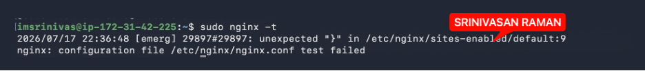

---

#### Screenshot 2 — Output of `sudo nginx -t` showing syntax ok (fixed config)

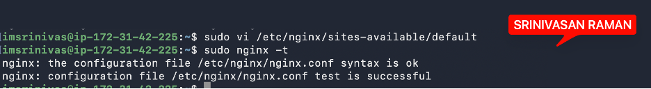

---

#### Screenshot 3 — Output of `curl -I http://<public-ip>` confirming recovery (200 OK)

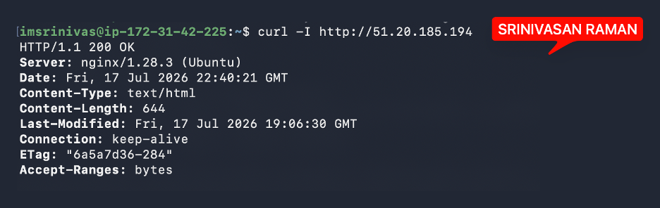

---

### Notes

Answer the following in your own words:

**1. What caused the configuration failure?**

I found two missing semicolons in /etc/nginx/sites-available/default — one on the try_files line, which I removed intentionally as part of the exercise, and a second one on the error_page 404 line that was already missing. Nginx's config parser is strict — even one missing semicolon is enough to break the entire server block. In this case there were two, either of which would have caused the syntax error on its own

---

**2. How did you fix the issue?**

I reopened the config file and added both semicolons back, then ran sudo nginx -t before doing anything else. Only after seeing syntax is ok and test is successful did I restart Nginx. Once it was back up, I ran curl -I from outside to confirm the site was actually serving correctly again — not just that the service had started, but that real traffic was getting through

---

**3. How can you avoid this kind of issue in real production systems?**

A few things I'd do differently going forward. I'd always run nginx -t after every config change, no exceptions, before touching restart or reload. I'd also keep Nginx config files in git — that way a bad change can be reverted instantly instead of trying to remember what the file looked like before. Beyond that, testing config changes in a staging environment before they ever reach production is the right habit to build. And ideally, config validation gets baked into the deployment pipeline itself, so a broken config gets caught in CI and never makes it to the live server in the first place.

---

# Task 7 — Web Application Failure Simulation

## Goal

Simulate missing deployment content and recover the application safely.

### Evidence

#### Screenshot 1 — Output of `curl -I http://<public-ip>` showing failure (non-200 response)

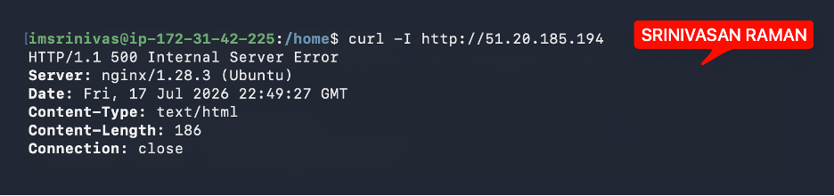

---

#### Screenshot 2 — Output of `curl -I http://<public-ip>` confirming recovery (200 OK)

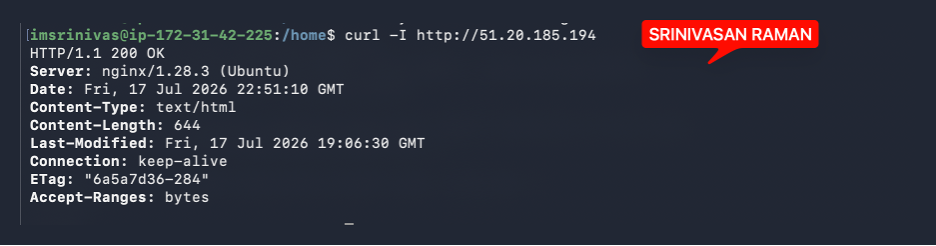

---

### Notes

Answer the following in your own words:

**1. What caused the application to break in this scenario?**

Nginx was still running and the config was fine, but the web root (/var/www/html) had been wiped — no files, nothing to serve. With no content and no fallback to fall back on, Nginx had no choice but to return a 500 Internal Server Error. The server itself wasn't broken, just empty.

---

**2. How did you fix the issue and restore the application?**

Since I'd moved the files to html_backup rather than deleting them, recovery was straightforward. I removed the empty directory and moved the backup back into place, then restarted Nginx to make sure it was serving cleanly from the restored files. A curl -I check from outside confirmed it — 200 OK, with the same Content-Length, Last-Modified, and ETag values as before the incident. Same build, fully restored

---

**3. What steps would you take to prevent this kind of issue in real production systems?**

A few things worth doing properly going forward. Pre-deployment backups should be automated so any release can be rolled back without scrambling. Better than overwriting the live directory in place, the cleaner approach is deploying to a versioned folder and flipping a symlink — something like /var/www/current — so a failed deploy never leaves the live path empty or half-written. On top of that, the CI/CD pipeline should verify the deployment actually worked before marking it complete, checking that index.html exists and isn't empty. And post-deployment health checks should automatically hit the live site and confirm a 200 response after every deploy — so if something goes wrong, it's caught in seconds rather than waiting for someone to notice.

---

# Task 8 — Security & Reliability Review

## Goal

Review and reflect on the security and reliability practices applied during this assignment.

### Security & Reliability Notes

Answer the following in your own words:

**1. Why is SSH key-based authentication more secure than sharing passwords?**

Password authentication has a few fundamental weaknesses — passwords can be guessed, brute-forced, reused across systems, or accidentally shared. If someone gets the password, they get in.

SSH key-based authentication works differently. There are two parts — a private key that never leaves my machine, and a public key that sits on the server. When I connect, the server checks if my private key matches the public key it has on file. No password is ever sent over the network, so there's nothing to intercept.

---

**2. Why should only required ports be open on a production server?**

Every open port is a potential entry point. If a service is running and listening on a port that doesn't need to be public, it's unnecessary risk — an attacker can probe it, exploit vulnerabilities in that service, or use it to get a foothold on the server.

In my case, only two ports need to be open — port 80 for HTTP traffic and port 22 for SSH. Everything else should be closed. If I had a database like MySQL running on port 3306 and left it exposed to the internet, anyone could attempt to connect to it directly. The database should only be reachable from within the server itself, not from outside.

The principle is simple — if a port doesn't need to be publicly accessible, it shouldn't be. Less exposure means less to defend. A server with two open ports is significantly harder to attack than one with ten.

---

**3. Why is it important for Nginx to be enabled on boot?**

If the server restarts for any reason — a crash, an OS update, a routine reboot — Nginx won't come back up on its own unless it's enabled on boot. The server is running but the website is down, and it stays down until someone manually starts Nginx again.

On a production server, that's not acceptable. No one should have to SSH in and run sudo systemctl start nginx every time the machine restarts. Enabling it on boot means Nginx starts automatically as part of the system startup process, so the site is back up within seconds of the server coming online — with no manual intervention needed.

It's a small config change but it's the difference between a server that recovers on its own and one that needs babysitting

---

**4. What are the risks of sharing secrets, keys, or credentials publicly?**

Once something is public, it's compromised — even if deleted seconds later, bots scan GitHub continuously and capture exposed secrets within minutes.

AWS credentials can lead to unauthorized instances being spun up and thousands of dollars in charges billed to your account. SSH private keys give anyone direct server access with no password required. Database credentials expose your data to theft, deletion, or ransom. The safest habit is to never let secrets touch version control at all — environment variables and .gitignore exist for exactly this reason.

---

**5. Why should cloud resources be stopped or terminated when they are no longer needed?**

Running cloud resources cost money even when idle. An EC2 instance sitting unused is still being billed by the hour.

On the Free Tier there are usage limits — if an instance runs past 750 hours a month, charges will be charged automatically.

---

# LinkedIn Post (Required)

## Evidence

#### LinkedIn Post URL

Paste your LinkedIn post URL here:

`Add your URL here`

---

#### Screenshot — Published LinkedIn post

Add your screenshot here.

---

# Submission Instructions

- Add all required screenshots in your submission
- Full name must be visible in required screenshots
- Do not expose sensitive information (keys, passwords, account IDs)

---

# Completion Checklist

- [ ] Task 1: Screenshots (browser, ip a, ss -tulpen, ufw status) + Notes answered
- [ ] Task 2: Screenshots (nginx status, nginx -t, ss port 80) + Notes answered
- [ ] Task 3: Screenshots (access log, error log, journalctl) + Notes answered
- [ ] Task 4: Screenshots (uptime, free -h, df -h, du -sh) + Notes answered
- [ ] Task 5: Screenshots (ls html, grep deployed by, grep try_files) + Notes answered
- [ ] Task 6: Screenshots (nginx -t fail, nginx -t pass, curl recovery) + Notes answered
- [ ] Task 7: Screenshots (curl failure, curl recovery) + Notes answered
- [ ] Task 8: Security & Reliability Notes answered
- [ ] LinkedIn post published and URL submitted
- [ ] Full Name visible in all required screenshots
- [ ] No sensitive data exposed

---

## 📌 About DMI & CloudAdvisory

DevOps Micro Internship (DMI) is a project-based DevOps program run by Pravin Mishra (The CloudAdvisory) focused on real-world execution, systems thinking, and career readiness.

It helps learners build strong DevOps foundations with hands-on experience.

---

## 📌 Resources

- 🌐 DMI Official Website: https://dmi.pravinmishra.com?utm_source=github&utm_medium=readme  
- 🎓 University: https://university.pravinmishra.com?utm_source=github&utm_medium=readme  
- 💬 Discord Community: https://discord.pravinmishra.com?utm_source=github&utm_medium=readme  
- 📝 Blog: https://dmi.pravinmishra.com/blog?utm_source=github&utm_medium=readme  
- ▶️ YouTube Playlist: https://www.youtube.com/playlist?list=PLFeSNDtI4Cho  
- 🔗 Pravin Mishra (LinkedIn): https://www.linkedin.com/in/pravin-mishra-aws-trainer/  
- 🏢 CloudAdvisory (LinkedIn): https://www.linkedin.com/company/thecloudadvisory/

---

*This submission is part of DevOps Micro Internship (DMI) Cohort 3 — Agentic AI Track.*