# Assignment 5 — Bash Script Automation Drill (OPS Checklist)

Part of the DevOps Micro Internship (DMI) Cohort 3 with Agentic AI

---

## Purpose

In this assignment, you will practice Bash scripting by building a series of small automation scripts covering environment setup, variables, arrays, loops, file conditionals, if-else logic, and functions. These scripts form the foundation of real-world Linux automation used in DevOps, cloud, and production support environments.

---

# Task 1 — Bash Environment & Workspace Setup

## Goal

Verify that Bash is available on your system and create a clean workspace for this assignment.

### Evidence

#### Screenshot 1 — Output of `echo $SHELL` and `bash --version`

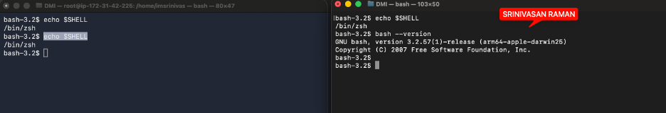

---

#### Screenshot 2 — Output of `pwd` and `ls -lah` showing the scripts directory

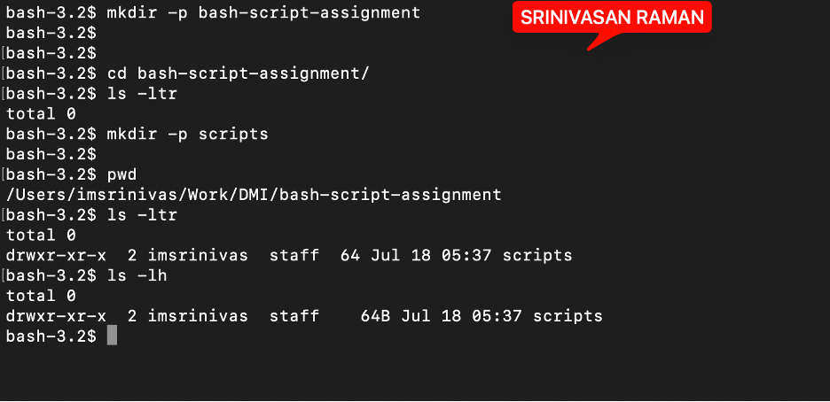

---

### Notes

Answer the following in your own words:

**1. What is Bash?**

Bash is the command-line language which is used to talk to Linux. Instead of clicking through a GUI, I type commands and the system executes them. It's what I've been using throughout this program to navigate directories, manage files, configure Nginx, check logs, and interact with the server — everything from cd and ls to systemctl and curl. 

It also supports scripting, so repetitive tasks can be written once and automated.

---

**2. What is the difference between shell and Bash?**

A shell is any command-line interpreter that lets you talk to the operating system. It's the general category.

Bash (Bourne Again Shell) is one specific shell — the most common one on Linux. There are others like zsh, sh, fish, and ksh, but Bash is what most servers run by default. So every time I use Bash, I'm using a shell, but not every shell is Bash.

---

**3. Why is it important to confirm the Bash version before writing scripts?**

Different Bash versions support different features and syntax. If I write a script using features from Bash 5.0 but the server only has Bash 3.2, the script will fail or behave unexpectedly.

I can check with bash --version before writing. If I know what version the target system has, I can either write code that's compatible with it or add version checks to handle differences. On a production server, I don't control the Bash version, so confirming it first prevents shipping broken scripts.

---

# Task 2 — Your First Bash Script

## Goal

Create your first Bash script, make it executable, and run it from the terminal.

### Evidence

#### Screenshot 1 — Content of `first-script.sh`

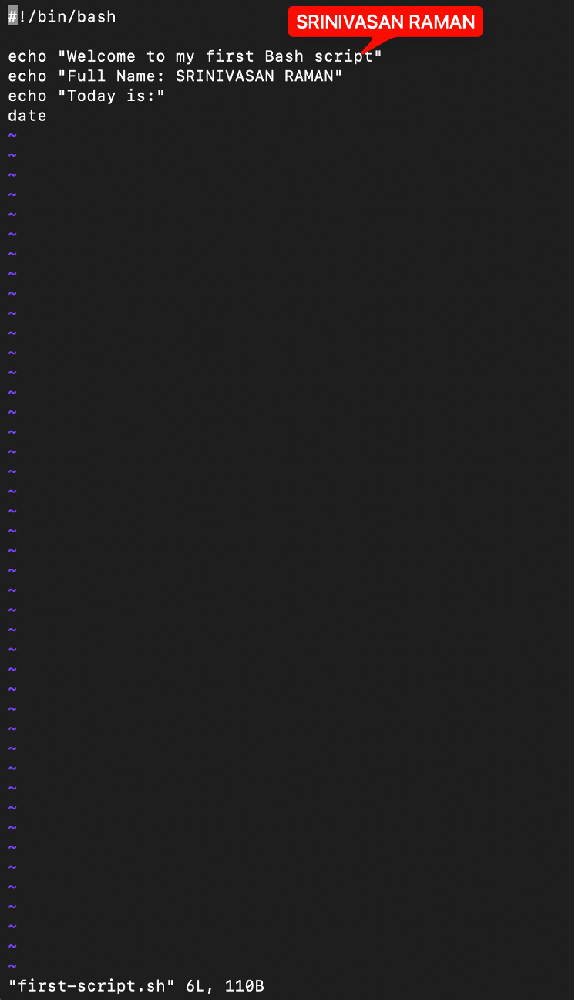

---

#### Screenshot 2 — Output of `./first-script.sh`

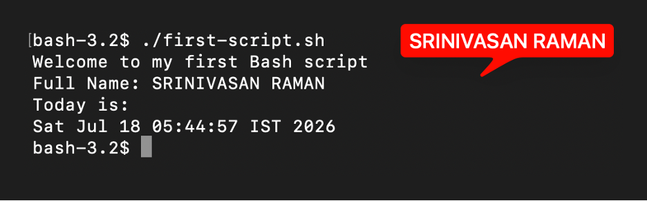

---

#### Screenshot 3 — Output of `ls -l first-script.sh` showing executable permission

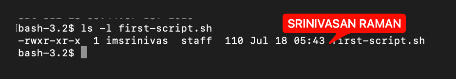

---

### Notes

Answer the following in your own words:

**1. What is the purpose of `#!/bin/bash`?**

#!/bin/bash is called a shebang. It's the first line of a script and tells the system which interpreter to use when running it.

When I execute a script like ./deploy.sh, the system reads the shebang and sees "use Bash to run this." Without it, the system doesn't know which shell to use — it might try to run it in the wrong one or fail entirely. It has to be the very first line of the file.    

---

**2. Why do we use `chmod +x` before running a script?**

A script is just a text file by default — it doesn't have execute permission. 

Running ./script.sh without execute permission returns "Permission denied," even if the shebang is correct.

chmod +x script.sh adds execute permission, so the file can actually be run as a command. After that, ./script.sh works.

---

**3. What is the difference between running a script using `./script.sh` and `bash script.sh`?**

./script.sh runs the file directly — the system reads the shebang line and uses whatever interpreter is specified there. The file needs execute permission for this to work.

bash script.sh explicitly tells the system to run it with Bash, bypassing the shebang entirely. It doesn't require execute permission since you're directly invoking Bash as the interpreter.

./script.sh is the cleaner approach for production — it respects the shebang and doesn't require specifying the interpreter every time. bash script.sh is useful for quick testing or if the file doesn't have execute permissions yet.

---

# Task 3 — Variables: User Information Script

## Goal

Use variables to store and display user-related information.

### Evidence

#### Screenshot 1 — Content of `user-info.sh`

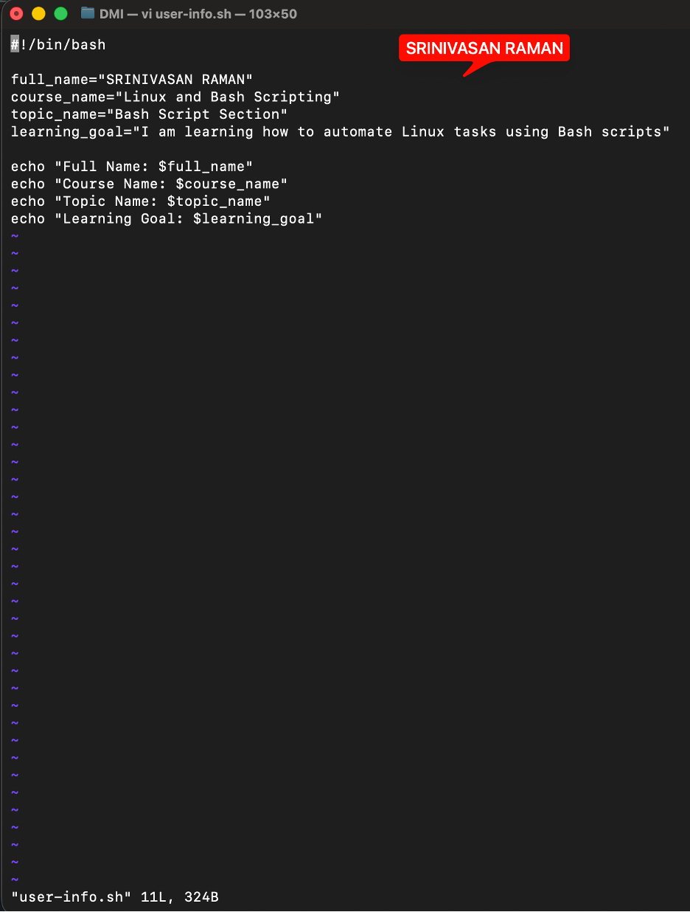

---

#### Screenshot 2 — Output of `./user-info.sh`

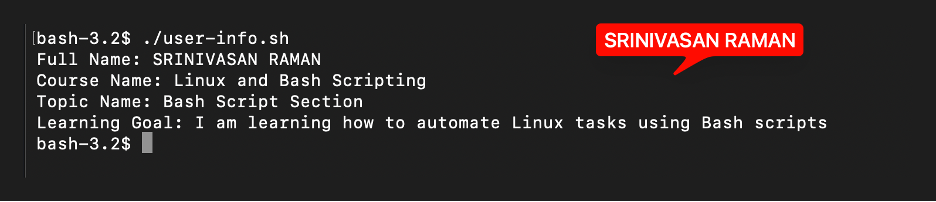

---

### Notes

Answer the following in your own words:

**1. What is a variable in Bash?**

A variable is a named container that holds a value. I create one by assigning a value to a name, then reference it later with a dollar sign.

Variables are useful for storing values I want to reuse throughout a script, or for making scripts flexible — instead of hardcoding values, I can pass them in as variables. 

---

**2. Why should we avoid spaces around the `=` sign when creating variables?**

Bash treats spaces around the = sign as delimiters. If I write name = "DMI" with spaces, Bash reads it as a command and tries to execute name with arguments, resulting in "command not found."
Without spaces — name="DMI" — Bash correctly interprets it as a variable assignment. The no-space format is how Bash recognizes you're creating a variable, not running a command.

---

**3. How do you access the value stored inside a Bash variable?**

A variable's value can be accessed using the dollar sign $ before the variable name. which is especially useful when the variable name is next to other characters and needs to be distinguished from surrounding text.

---

# Task 4 — Arrays & Loops: Tools Checklist Script

## Goal

Use arrays and loops to print a checklist of tools used in Bash scripting.

### Evidence

#### Screenshot 1 — Content of `tools-checklist.sh`

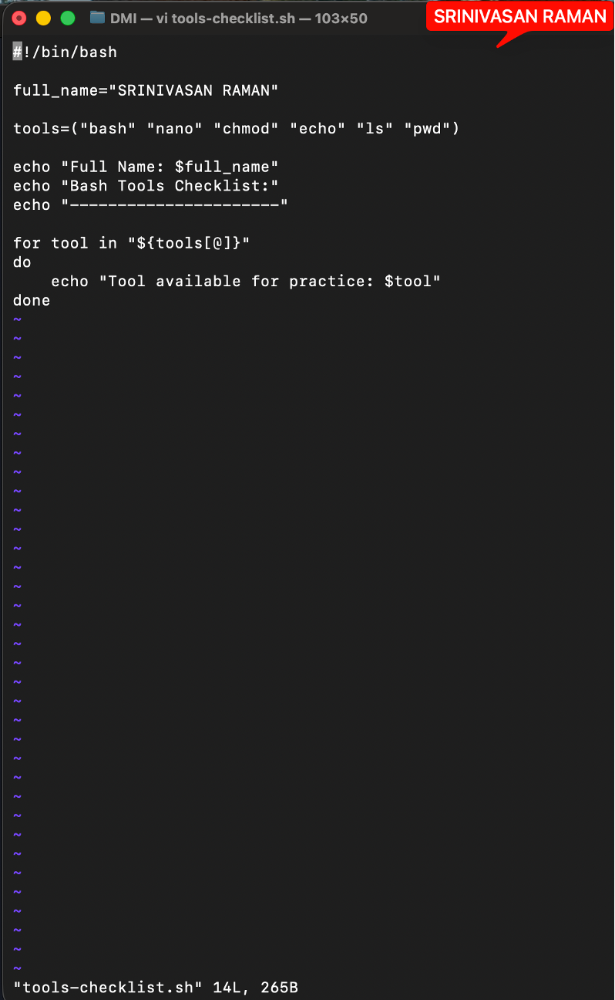

---

#### Screenshot 2 — Output of `./tools-checklist.sh`

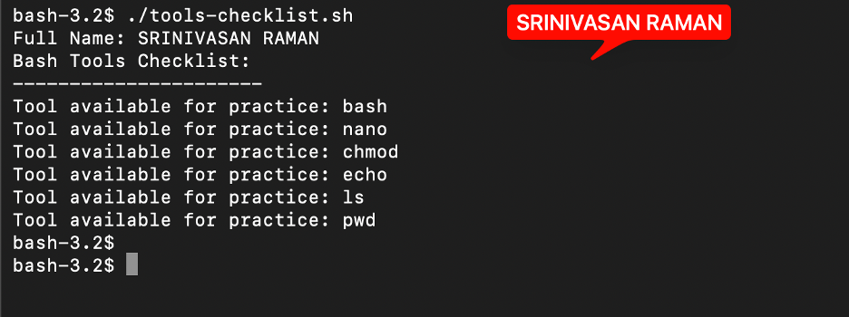

---

### Notes

Answer the following in your own words:

**1. What is an array in Bash?**

Add your answer here.

---

**2. Why are arrays useful in scripts?**

Add your answer here.

---

**3. What does `"${tools[@]}"` mean?**

Add your answer here.

---

**4. What is the purpose of the `for` loop in this script?**

Add your answer here.

---

# Task 5 — Loops: Number Counter Script

## Goal

Use loops to repeat a task multiple times.

### Evidence

#### Screenshot 1 — Content of `counter.sh`

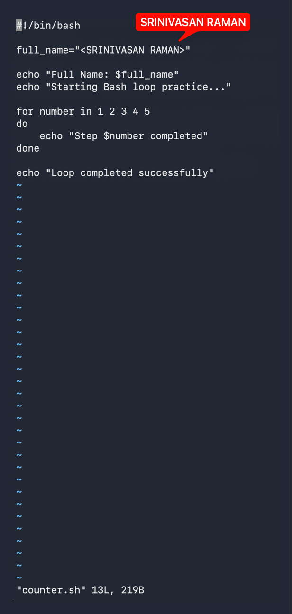

---

#### Screenshot 2 — Output of `./counter.sh`

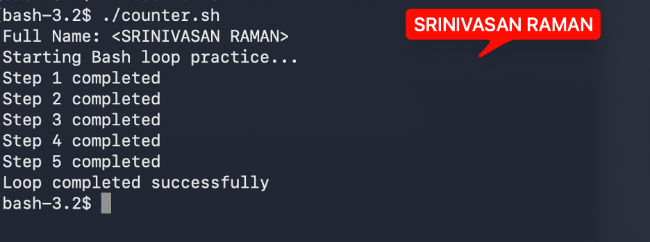

---

### Notes

Answer the following in your own words:

**1. What is a loop?**

Add your answer here.

---

**2. Why do we use loops in Bash scripting?**

Add your answer here.

---

**3. How many times did the loop run in your script?**

Add your answer here.

---

**4. What would you change if you wanted the loop to run 10 times?**

Add your answer here.

---

# Task 6 — Files & Conditionals: File Validation Script

## Goal

Use file checks and conditionals to verify whether files and directories exist.

### Evidence

#### Screenshot 1 — Output of `ls -lah ../test-folder`

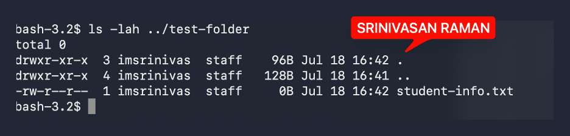

---

#### Screenshot 2 — Content of `file-check.sh`

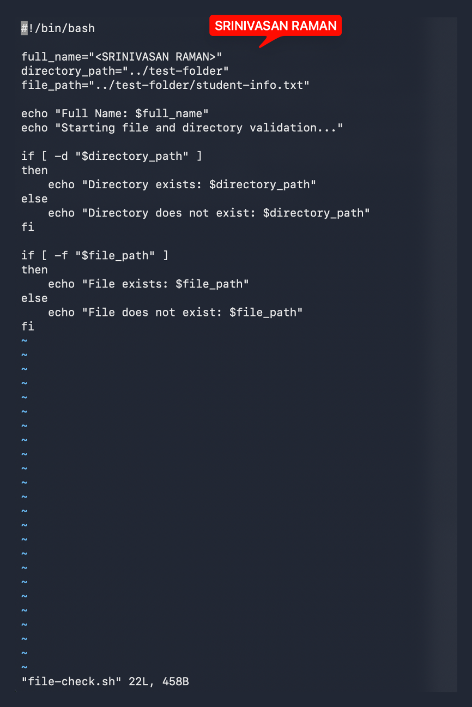

---

#### Screenshot 3 — Output of `./file-check.sh`

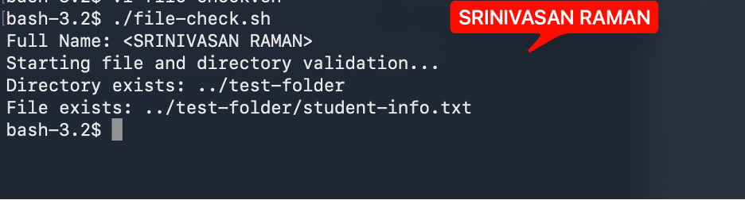

---

### Notes

Answer the following in your own words:

**1. What does `-d` check in Bash?**

Add your answer here.

---

**2. What does `-f` check in Bash?**

Add your answer here.

---

**3. Why should file and directory paths be stored in variables?**

Add your answer here.

---

**4. What happens if the file does not exist?**

Add your answer here.

---

# Task 7 — Conditionals: Pass or Retry Script

## Goal

Use if-else conditionals to make decisions based on a variable value.

### Evidence

#### Screenshot 1 — Content of `score-check.sh` with `score=85`

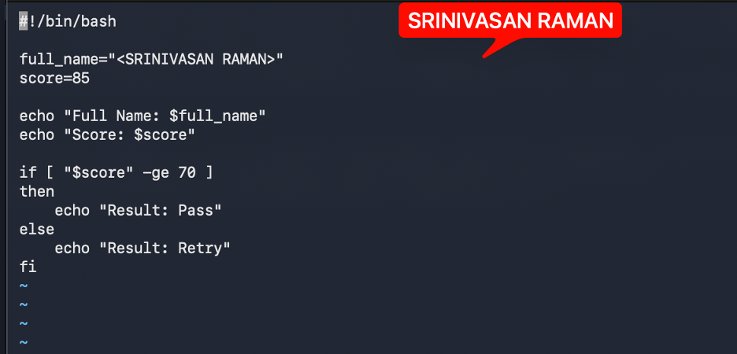

---

#### Screenshot 2 — Output showing `Result: Pass`

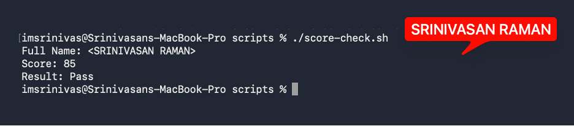

---

#### Screenshot 3 — Content of `score-check.sh` with `score=55`

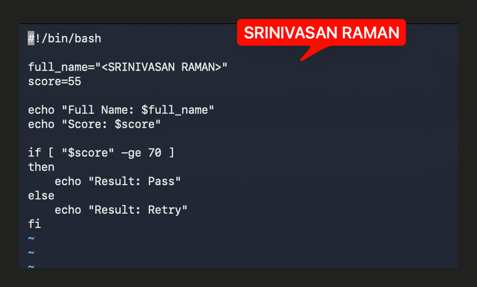

---

#### Screenshot 4 — Output showing `Result: Retry`

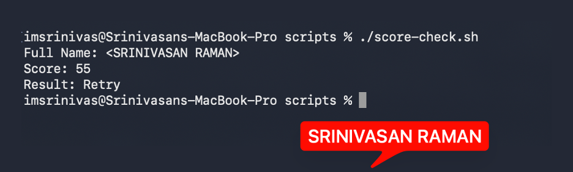

---

### Notes

Answer the following in your own words:

**1. What is the purpose of if-else in Bash?**

Add your answer here.

---

**2. What does `-ge` mean?**

Add your answer here.

---

**3. Why should conditions be tested with different values?**

Add your answer here.

---

**4. How can conditionals help in automation scripts?**

Add your answer here.

---

# Task 8 — Functions: Final Bash Automation Script

## Goal

Create a final Bash script using functions to organize reusable code.

### Evidence

#### Screenshot 1 — Content of `final-automation.sh`

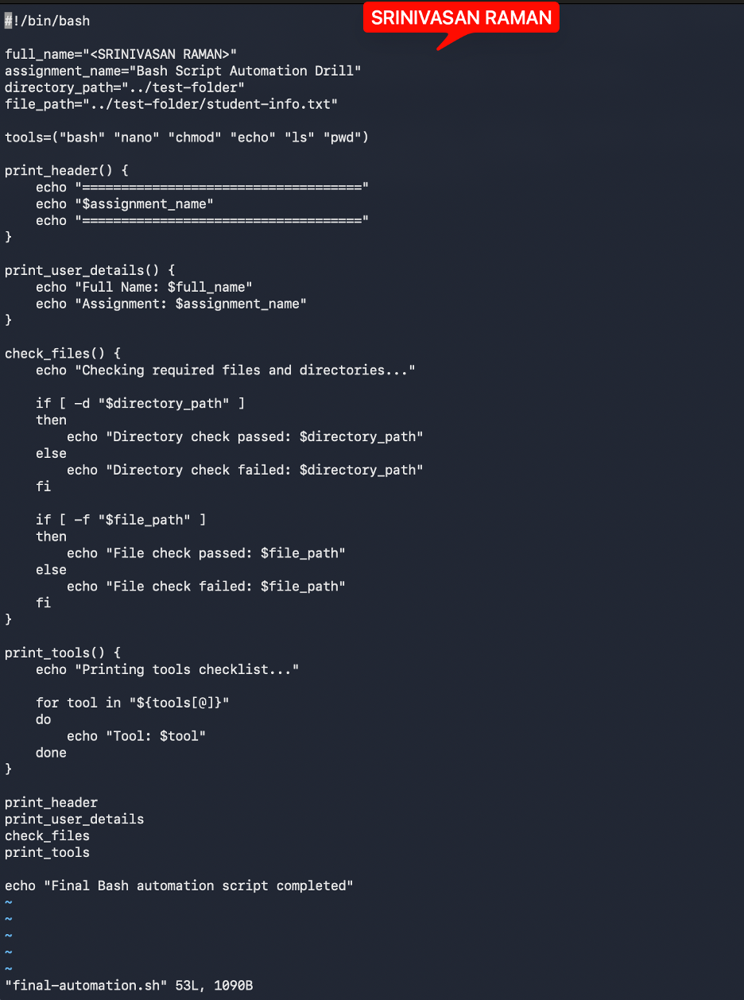

---

#### Screenshot 2 — Output of `./final-automation.sh`

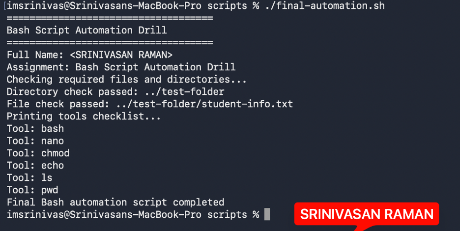

---

#### Screenshot 3 — Output of `ls -lah` showing all created scripts

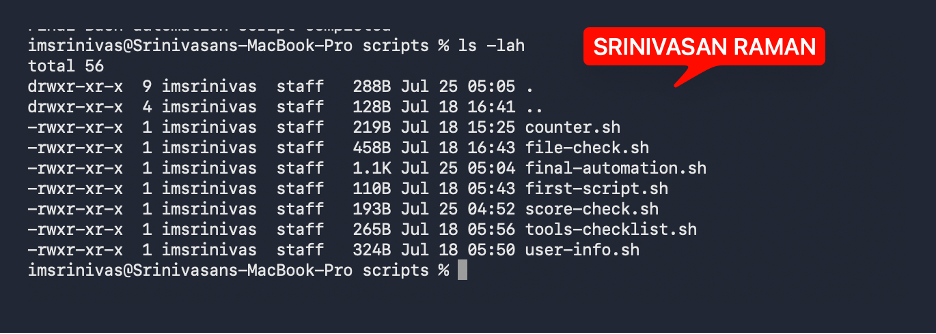

---

### Notes

Answer the following in your own words:

**1. What is a function in Bash?**

Add your answer here.

---

**2. Why are functions useful in scripts?**

Add your answer here.

---

**3. Which functions did you create in this script?**

Add your answer here.

---

**4. How does this final script combine variables, arrays, loops, conditionals, files, and functions?**

Add your answer here.

---

# LinkedIn Post (Required)

## Evidence

#### LinkedIn Post URL

Paste your LinkedIn post URL here:

`Add your URL here`

---

#### Screenshot — Published LinkedIn post

Add your screenshot here.

---

# Submission Instructions

- Add all required screenshots in your submission
- Full name must be visible in required screenshots
- All script files must be created and run successfully
- Required notes must be answered clearly for every task
- Do not expose sensitive information (keys, passwords, credentials)

---

# Completion Checklist

- [ ] Task 1: Environment setup verified, workspace created (Screenshots 1–2, Notes answered)
- [ ] Task 2: First script created, executed, permissions verified (Screenshots 1–3, Notes answered)
- [ ] Task 3: Variables script created and run (Screenshots 1–2, Notes answered)
- [ ] Task 4: Arrays and loops script created and run (Screenshots 1–2, Notes answered)
- [ ] Task 5: Counter loop script created and run (Screenshots 1–2, Notes answered)
- [ ] Task 6: File validation script created and run (Screenshots 1–3, Notes answered)
- [ ] Task 7: Pass/Retry conditional script tested with both values (Screenshots 1–4, Notes answered)
- [ ] Task 8: Final automation script created and run (Screenshots 1–3, Notes answered)
- [ ] All scripts run without errors
- [ ] Full Name visible in all required screenshots
- [ ] LinkedIn post published and URL submitted
- [ ] No sensitive data exposed

---

## 📌 About DMI & CloudAdvisory

DevOps Micro Internship (DMI) is a project-based DevOps program run by Pravin Mishra (The CloudAdvisory) focused on real-world execution, systems thinking, and career readiness.

It helps learners build strong DevOps foundations with hands-on experience.

---

## 📌 Resources

- 🌐 DMI Official Website: https://pravinmishra.com/dmi  
- 🎓 DevOps for Beginners (Udemy): https://www.udemy.com/course/devops-for-beginners-docker-k8s-cloud-cicd-4-projects/  
- 🎓 Agentic AI DevOps with Claude Code: https://www.udemy.com/course/ultimate-agentic-ai-devops-with-claude-code/  
- 🎓 DevOps with Claude Code: Terraform, EKS, ArgoCD & Helm: https://www.udemy.com/course/devops-with-claude-code-terraform-eks-argocd-helm/  
- ▶️ YouTube Playlist: https://www.youtube.com/playlist?list=PLFeSNDtI4Cho  
- 🔗 Pravin Mishra (LinkedIn): https://www.linkedin.com/in/pravin-mishra-aws-trainer/  
- 🏢 CloudAdvisory (LinkedIn): https://www.linkedin.com/company/thecloudadvisory/

---

*This submission is part of DevOps Micro Internship (DMI) Cohort 3 — Agentic AI Track.*