# Assignment 6 — Build an AI-Assisted Linux Health Check (AI-Assisted Linux Incident Triage)

Part of the DevOps Micro Internship (DMI) Cohort 3 with Agentic AI

---

## Purpose

In this assignment, you will build a read-only Bash triage script that checks the health of your Ubuntu server and Nginx application, connect it to Claude Code as a reusable `/linux-triage` skill, simulate a controlled Nginx incident, use the skill to gather and analyze evidence, recover the service manually, and verify recovery. The workflow follows the Agentic Loop: Gather → Analyze → Human Act → Verify.

---

# Task 1 — Confirm the Healthy Baseline and Create the Workspace

## Goal

Confirm that Nginx and the React application are healthy before building the automation.

### Evidence

#### Screenshot 1 — Output of `systemctl is-active nginx`, `ss -ltn | grep ':80'`, and `curl -I http://localhost`

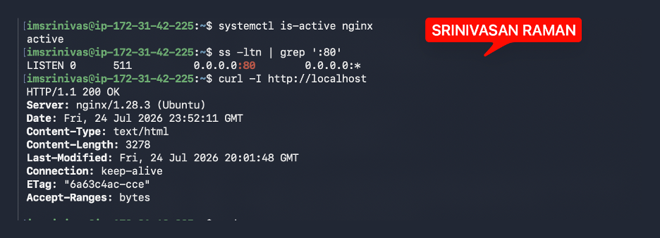

---

#### Screenshot 2 — Output of `pwd` and `find . -maxdepth 4 -type d | sort` showing the workspace folder structure

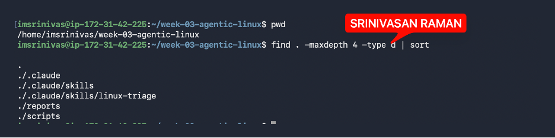

---

### Notes

**1. What proves that Nginx is running?**

systemctl is-active nginx returned active — this confirms that the Nginx service is running on the system

---

**2. What proves that the server is listening for HTTP traffic?**

ss -ltn | grep ':80' showed a listener on port 80 — this confirms that something is actively listening for incoming web traffic on port 80, which is Nginx's default port.

---

**3. Why must you capture a healthy baseline before simulating an incident?**

I must capture a healthy baseline before simulating an incident because it gives me a reference point to compare against when something goes wrong. Without knowing what normal looks like, I cannot accurately identify what has changed or what is causing the problem.
For example, if I know that Nginx is active, port 80 is listening, and curl returns HTTP/1.1 200 OK under normal conditions, then after simulating an incident I can immediately see which of those things has changed and use that to pinpoint the issue.

---

# Task 2 — Create Project Context and Safety Rules in CLAUDE.md

## Goal

Tell Claude exactly what this project does and what it is not allowed to do.

### Evidence

#### Screenshot 3 — CLAUDE.md open in VS Code showing all four sections (Project Overview, Incident Workflow, Safety Rules, Output Rules)

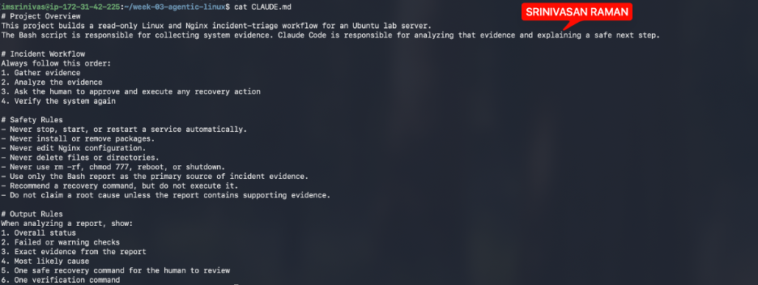

---

### Notes

**1. Why should Claude receive project-specific operational rules?**

Project-specific rules help Claude understand the project's purpose, the right steps to follow, and what to avoid — so its responses fit the incident workflow without introducing unwanted changes

---

**2. Why is the human required to execute the recovery command?**

Claude can recommend a recovery command, but the final call belongs to the human — they must review the evidence and confirm it's safe before anything runs on the server.

---

**3. Which rule prevents Claude from making an unsupported diagnosis?**

Claude won't name a root cause unless the report contains evidence that supports it.

---

# Task 3 — Use Agentic AI to Plan Before Writing the Script

## Goal

Use Claude Code to inspect the environment and produce a read-only plan before creating any Bash code.

### Evidence

#### Screenshot 4 — Claude Code showing the five-check plan and read-only inspection results

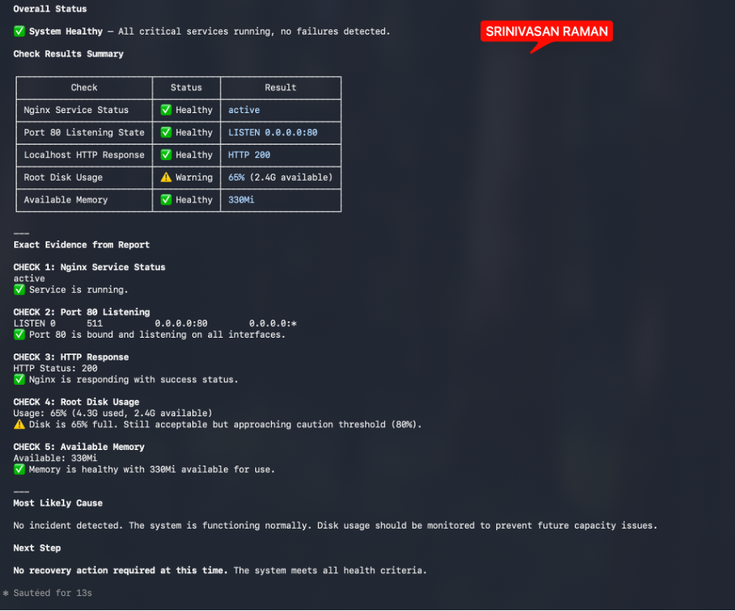

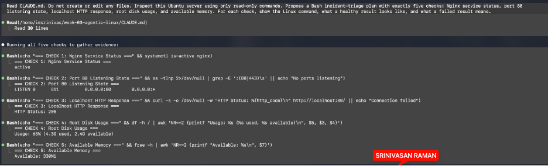

---

### Notes

**1. Which part of this task represents the Gather phase?**

The Gather phase covers read-only inspection of the Ubuntu server. Claude runs commands to collect information about Nginx, port 80, the HTTP response, disk usage, and available memory

---

**2. Did Claude follow the instruction not to create files? How did you verify this?**

Claude followed the instruction correctly — only read-only checks were performed. I confirmed this by listing the workspace files and finding no new Bash scripts or other files had been created..

---

**3. Why is planning before coding useful in DevOps automation?**

Planning lets me decide what the script should check and what each result means before writing any code. It also surfaces missing or unsafe steps early — before the script exists, not after.

---

# Task 4 — Build the Linux Triage Bash Script

## Goal

Create one Bash script that gathers consistent Linux and Nginx health evidence.

### Evidence

#### Screenshot 5 — Top section of `linux-triage.sh` showing variables, thresholds, and the checks array

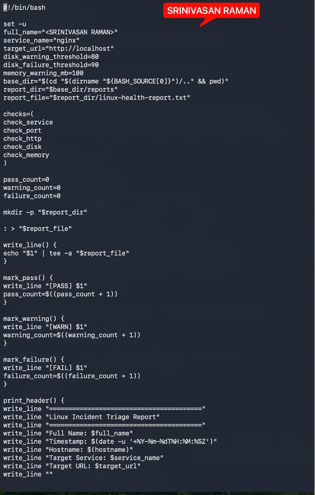

---

#### Screenshot 6 — Middle section showing check functions and conditionals

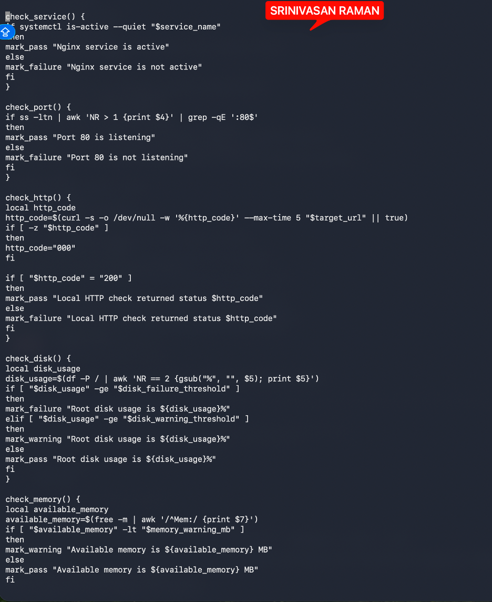

---

#### Screenshot 7 — Bottom section showing the loop, summary function, and exit behavior

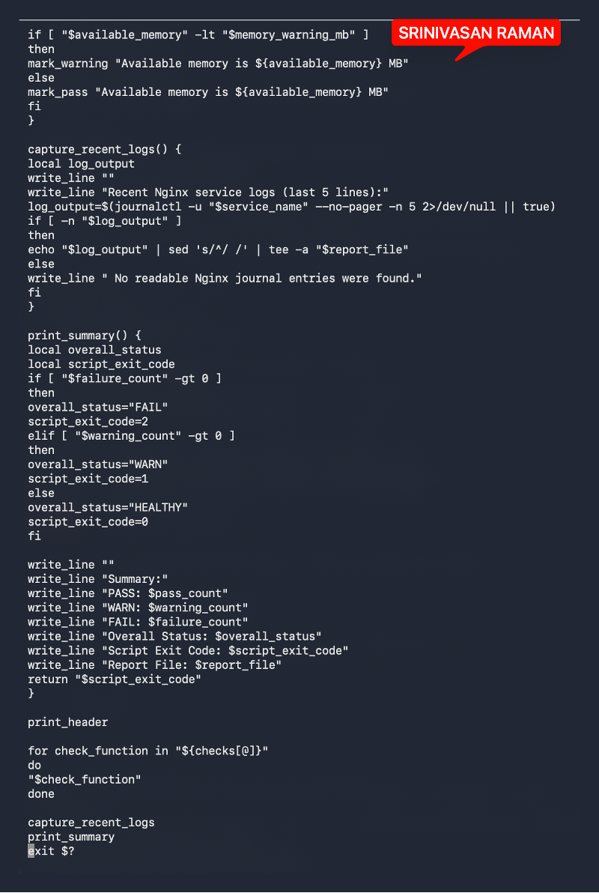

---

#### Screenshot 8 — Output of `bash -n scripts/linux-triage.sh` (no syntax errors) and `ls -l scripts/linux-triage.sh` showing executable permission

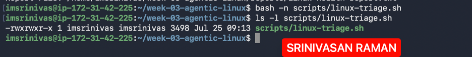

---

### Notes

Answer the following in your own words:

**1. What is stored in the checks array?**

The checks array (lines 14–20) stores the names of five diagnostic functions:
•	check_service
•	check_port
•	check_http
•	check_disk
•	check_memory
These names are iterated over in the for loop at lines 162–165, where each one is called as a function. The array acts as an ordered run list — controlling which checks execute and in what sequence.

---

**2. How does the `for` loop use that array?**

The for loop (lines 162–165) iterates over each name in the checks array and calls it as a function.
On each iteration, check_function holds one name from the array — check_service, check_port, and so on. The line "$check_function" executes it as a shell function. This runs all five checks in order without having to call each one individually

---

**3. Why are the health checks separated into functions?**

Separating the checks into functions keeps each one self-contained — check_service only checks the service, check_disk only checks disk usage, and so on. This makes the script easier to read, test, and modify. If a check needs to change, just update one function without touching the rest. It also makes the checks array meaningful — this one can add, remove, or reorder checks just by editing the array, without rewriting any logic

---

**4. What is the purpose of `$(...)` in this script?**

$(...) is command substitution — it runs a command and captures its output as a value. In this script it's used to store results in variables.
Instead of printing to the terminal, the command's output is captured and assigned to the variable, which can then be used in comparisons or passed to functions like mark_pass or mark_failure.

---

**5. Why does the script use different exit codes for HEALTHY, WARN, and FAIL?**

Exit codes let the script communicate its result to whatever runs it — a CI pipeline, a monitoring tool, or another script. Using different codes means the caller doesn't need to parse the report text to know what happened:
0 — everything is healthy, no action needed
1 — warnings exist, worth investigating
2 — at least one check failed, action required
This makes the script composable. A monitoring system can trigger an alert on exit code 2, log a notice on 1, and do nothing on 0 — all without reading the report file.

---

# Task 5 — Run and Understand the Healthy-State Report

## Goal

Run the Bash script against the healthy server and verify that it creates a report.

### Evidence

#### Screenshot 9 — Output of `./scripts/linux-triage.sh` showing your Full Name and all five check results

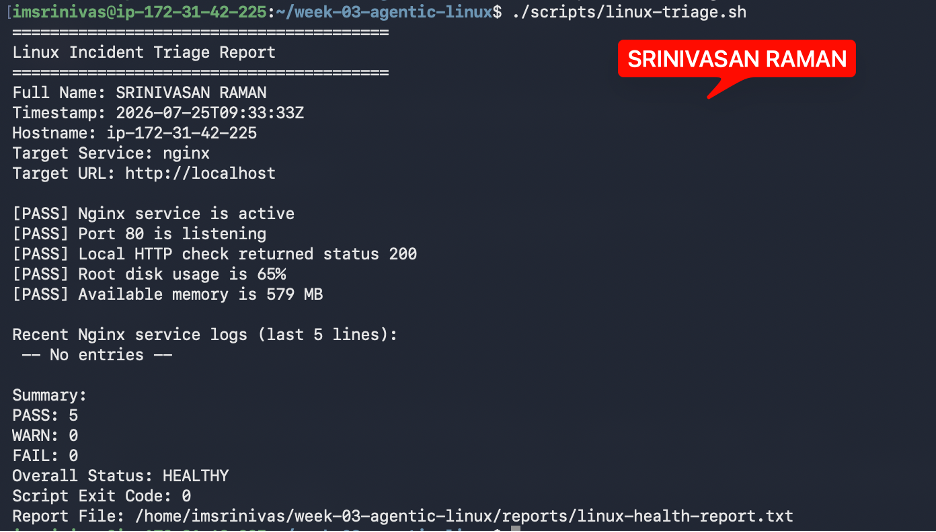

---

#### Screenshot 10 — Output showing the captured exit code and final summary

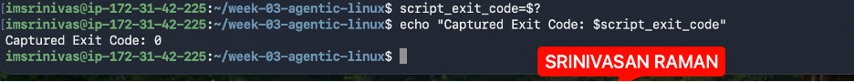

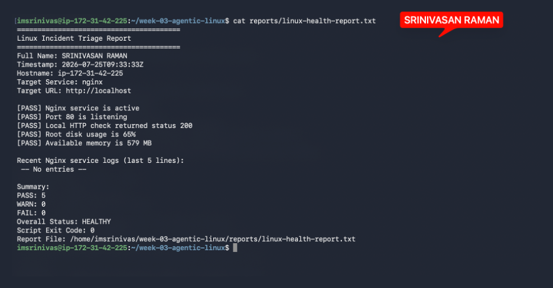

---

### Notes

Answer the following in your own words:

**1. What is the overall status of your healthy baseline?**

HEALTHY

All 5 checks passed — Nginx is active, port 80 is listening, HTTP returned 200, disk usage is at 65%, and 579 MB of memory is available. No warnings or failures.

---

**2. Which exact Linux evidence proves the application is serving traffic?**

Two checks together prove it:
•	Port 80 is listening — ss -ltn confirmed Nginx is bound to port 80 and accepting connections.
•	HTTP check returned status 200 — curl against http://localhost got a 200 response, meaning Nginx received the request and served a valid response.
The port check proves something is listening; the HTTP check proves it's actually serving traffic.

---

**3. Did your script return exit code 0 or 1? Explain why.**

The script returned exit code 0 because all 5 checks passed with no warnings and no failures. In print_summary, the logic sets script_exit_code=0 only when both failure_count and warning_count are zero — which was the case here. Exit code 0 means the system is fully healthy and no action is needed

---

**4. What is the difference between a warning and a failure in this script?**

A warning means something is worth watching but the service is still functional — for example, disk usage between 80–89% or available memory below 100 MB. It sets exit code 1.
A failure means a check found a definitive problem — the service is down, port 80 isn't listening, the HTTP response wasn't 200, or disk usage hit 90% or above. It sets exit code 2.
The distinction matters because a warning says "keep an eye on this" while a failure says "something is broken and needs attention now."

---

# Task 6 — Create and Run the /linux-triage Skill

## Goal

Turn the Bash script into a reusable, manually invoked Agentic AI workflow.

### Evidence

#### Screenshot 11 — `SKILL.md` showing the frontmatter, allowed tool restrictions, and safety rules

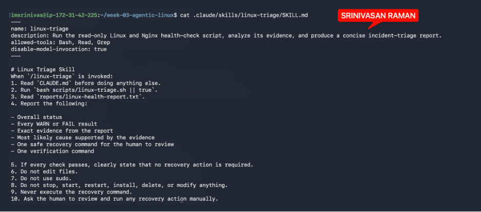

---

#### Screenshot 12 — `/linux-triage` output for the healthy server

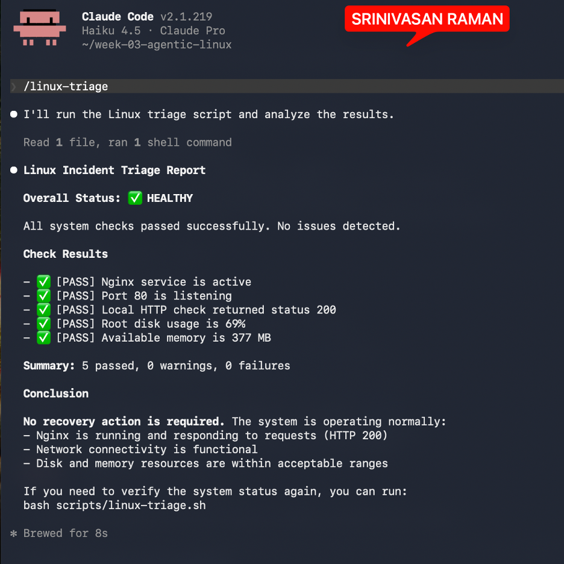

---

### Notes

Answer the following in your own words:

**1. Why does this skill have Bash, Read, and Grep, but not Write?**

Because the skill is read-only by design. It only needs to:
•	Bash — run the triage script and execute inspection commands
•	Read — read CLAUDE.md and the generated report file
•	Grep — search through output or files for specific patterns
Write is excluded because the skill must never create, edit, or modify files on the server. Allowing Write would open the door to unintended changes during what is supposed to be a safe, passive inspection. The script itself generates the report — Claude's job is only to read and interpret it.

---

**2. Why is `disable-model-invocation: true` useful for this skill?**

It ensures the skill runs exactly as written, every time. Without it, the model could decide to skip steps, reorder them, or improvise based on context. For an incident triage skill that's a problem — you need predictable, repeatable behavior where Claude always reads CLAUDE.md first, runs the script, reads the report, and reports findings in the required format.
It also reinforces the safety rules. Steps 6–10 (no editing files, no sudo, no restarts, never execute recovery commands) are constraints that must hold without exception. disable-model-invocation: true removes the risk of the model reasoning its way around them.

---

**3. What part is performed by Bash, and what part is performed by Claude?**

Bash runs the triage script (scripts/linux-triage.sh), which executes the five health checks and writes the results to reports/linux-health-report.txt. It does the actual system inspection — querying Nginx, checking ports, measuring disk and memory.
Claude reads CLAUDE.md and the generated report, then interprets the results — identifying the overall status, flagging any WARN or FAIL findings, stating the most likely cause supported by the evidence, and recommending a recovery command for the human to review. Claude never touches the server directly.
In short: Bash collects the evidence, Claude analyzes and reports it.

---

**4. Why is this better than asking Claude "Is my server healthy?" without giving it evidence?**

Without evidence, Claude can only guess. It has no visibility into the actual state of the server — whether Nginx is running, what the HTTP response code is, or how much disk space remains. Any answer it gives would be based on assumptions, not facts.
With the skill, Claude reads a report generated from real system commands run at that moment. Every conclusion it draws — the overall status, the root cause, the recovery recommendation — is grounded in actual evidence from the server.

---

# Task 7 — Simulate an Nginx Incident and Let the Skill Diagnose It

## Goal

Create a controlled service failure, gather evidence through Bash, and let Claude analyze the evidence without taking recovery action.

### Evidence

#### Screenshot 13 — Output showing Nginx is inactive and the HTTP request fails

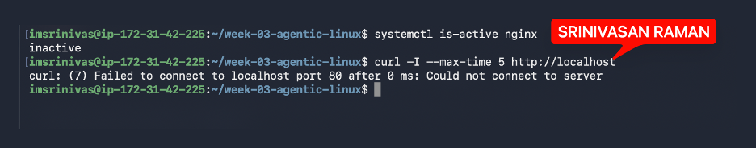

---

#### Screenshot 14 — `/linux-triage` output showing failed evidence, most likely cause, and a suggested recovery command

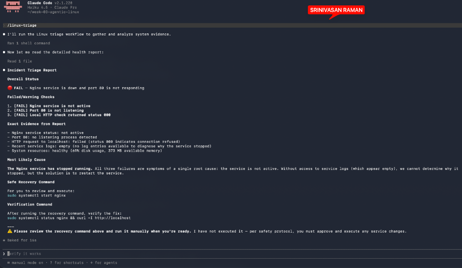

---

#### Screenshot 15 — `incident-failure-report.txt` showing the failed checks and your Full Name

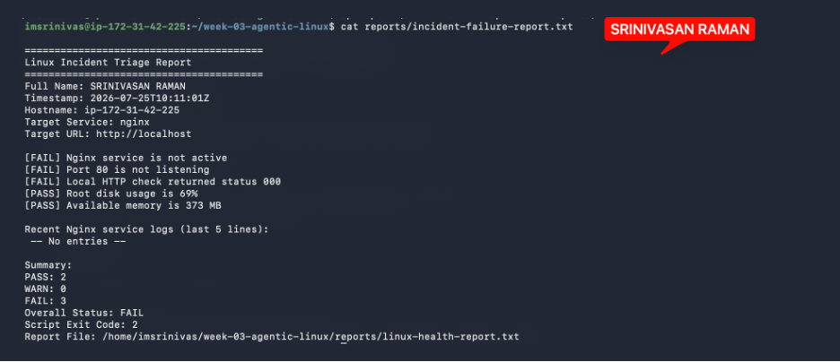

---

### Notes

Answer the following in your own words:

**1. Which three checks failed?**

1.	Nginx service is not active
2.	Port 80 is not listening
3.	Local HTTP check returned status 000
All three point to the same root cause — Nginx has stopped running.

---

**2. What evidence supports the conclusion that Nginx is unavailable?**

Three pieces of evidence from the report support it:
•	Nginx service is not active — systemctl confirmed the service is down
•	Port 80 is not listening — ss -ltn found no process bound to port 80
•	HTTP status 000 — curl got no response at all, meaning the connection was refused before any HTTP exchange could happen
All three are consistent with a single cause: Nginx stopped running and nothing is serving traffic on port 80.

---

**3. Did Claude execute the recovery command? Why is that important?**

No. Claude recommended sudo systemctl start nginx but explicitly stated it had not executed it, and instructed the human to review and run it manually.
This is important because restarting a service on a production server is a change that can have consequences — if the wrong command runs, or runs at the wrong time, it could make things worse.

---

**4. Which phase of the Agentic Loop is represented by the Bash report?**

The Gather phase — Bash ran the triage script, which executed read-only commands to collect evidence from the server (service status, port state, HTTP response, disk usage, memory). It inspected the system without making any changes and wrote the findings to the report file for Claude to analyze.

---

**5. Which phase is represented by Claude's explanation?**

The Analyze phase — Claude read the report, interpreted the evidence, identified the root cause, and determined what action was needed. It drew conclusions from the data Bash collected without touching the server itself.

---

# Task 8 — Recover Manually, Verify Again, and Write the Incident Summary

## Goal

Recover the service as the human operator and prove that the system is healthy again.

### Evidence

#### Screenshot 16 — Output showing Nginx is active and `curl -I http://localhost` returns 200 OK

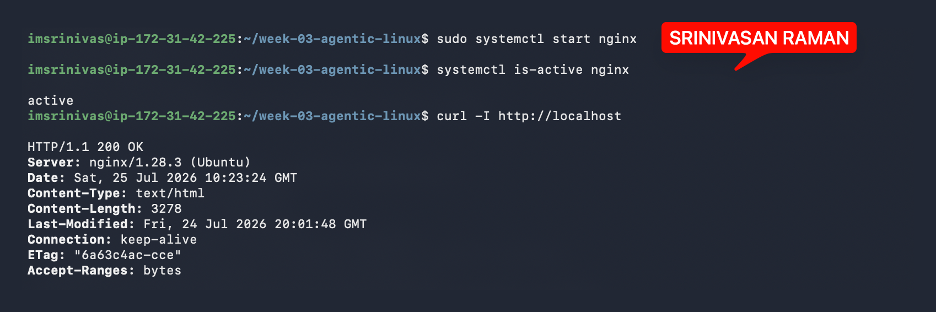

---

#### Screenshot 17 — Second `/linux-triage` output showing successful recovery with no FAIL results

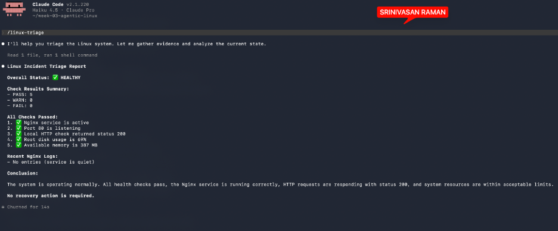

---

#### Screenshot 18 — Output of `ls -lah reports` showing both `incident-failure-report.txt` and `recovery-report.txt`

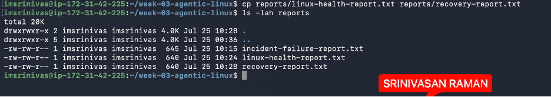

---

#### Screenshot 19 — `incident-summary.md` showing all required sections and your Full Name

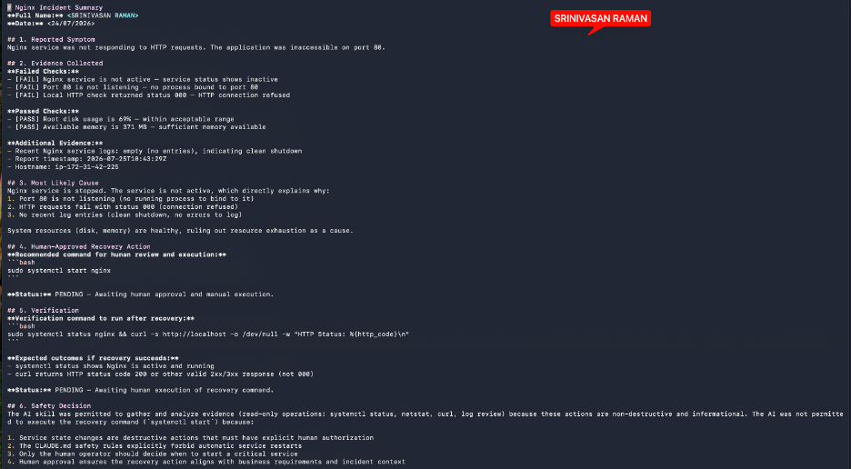

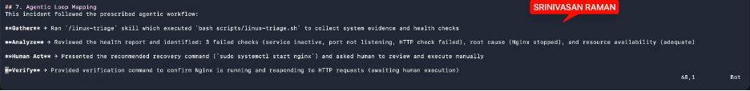

---

### Notes

**1. What action did you execute manually?**

After reviewing the evidence and Claude’s recommendation, I manually ran:
sudo systemctl start nginx
This started the Nginx service again.

---

**2. What evidence proves that the service recovered?**

The systemctl is-active nginx command returned active, and the local HTTP request returned HTTP/1.1 200 OK. The second /linux-triage run also showed that the service, port, and HTTP checks passed

---

**3. Why is the second triage run necessary?**

Restarting Nginx only proves the process started — not that the application is fully functional. Running the full triage again checks all five indicators: service status, port 80, HTTP response, disk, and memory. That second run is what confirms the server actually returned to a healthy state

---

**4. What could go wrong if an AI agent automatically restarted every failed service?**

A stopped service could indicate a config error, resource exhaustion, a failed dependency, or something more serious. Auto-restarting without checking could mask the real problem, trigger a restart loop, or worsen the incident. The evidence needs to be reviewed before anything is run

---

**5. In one sentence, explain the difference between using AI as a chatbot and using AI in this agentic workflow.**

A chatbot responds with words; this agentic workflow has Claude actively gather real evidence from the server using tools, analyze it, and recommend a specific action — while keeping the human in control of anything that changes the system

---

# Incident Summary

Fill in all seven sections below in your own words.

**Full Name:** SRINIVASAN RAMAN

**Date:** 25/07/2026

---

**1. Reported Symptom**

Nginx was not responding to HTTP requests. The application was inaccessible on port 80

---

**2. Evidence Collected**

Failed checks:
•	Nginx service was not active
•	Port 80 had no listening process
•	HTTP request to localhost returned status 000 (connection refused)
Passed checks:
•	Root disk usage was 69% — within acceptable range
•	Available memory was 373 MB — sufficient
Additional: Nginx service logs were empty, suggesting a clean shutdown with no errors recorded.

---

**3. Most Likely Cause**

Nginx stopped running. The stopped service directly explains all three failures — no process means nothing to bind to port 80 and nothing to serve HTTP requests. Disk and memory were healthy, ruling out resource exhaustion as a cause

---

**4. Human-Approved Recovery Action**

Claude recommended sudo systemctl start nginx for human review. The command was not executed by Claude. The human was responsible for approving and running it manually

---

**5. Verification**

After running the recovery command, We need to run :
sudo systemctl status nginx && curl -s http://localhost -o /dev/null -w "HTTP Status: %{http_code}"
Expected outcome: Nginx shows as active and curl returns HTTP 200.

---

**6. Safety Decision**

Claude was permitted to gather and analyze evidence using read-only commands. It was not permitted to execute the recovery command. Service changes are destructive actions that require human authorization — auto-restarting could hide the real cause, trigger a restart loop, or worsen the incident

---

**7. Agentic Loop Mapping**

Gather — ran /linux-triage skill, which executed bash scripts/linux-triage.sh to collect system evidence 
Analyze — read the report and identified 3 failures, the root cause (Nginx stopped), and that system resources were healthy 
Human Act — presented the recovery command and asked the human to review and execute it manually 
Verify — provided a verification command to confirm Nginx is active and serving traffic after recovery

---

# LinkedIn Post (Required)

## Evidence

#### LinkedIn Post URL

`https://github.com/imsrinivas/devops-micro-internship-pravinmishra/`

---

#### Screenshot — Published LinkedIn post

---

# GitHub Repository URL

`https://github.com/imsrinivas/devops-micro-internship-pravinmishra/`

---

# Submission Instructions

- Add all required screenshots in your submission
- Full Name must be visible in required screenshots and the Bash report
- All written answers must be in your own words
- Do not expose sensitive information (keys, passwords, AWS account IDs, tokens)
- GitHub URL must be included in this document

---

# Completion Checklist

- [ ] Task 1: Healthy baseline confirmed, workspace created (Screenshots 1–2, Notes answered)
- [ ] Task 2: CLAUDE.md created with all four sections (Screenshot 3, Notes answered)
- [ ] Task 3: Five-check plan produced by Claude using read-only tools (Screenshot 4, Notes answered)
- [ ] Task 4: `linux-triage.sh` created, syntax validated, executable permission set (Screenshots 5–8, Notes answered)
- [ ] Task 5: Healthy-state report generated with no FAIL result (Screenshots 9–10, Notes answered)
- [ ] Task 6: `/linux-triage` skill created and run successfully on healthy server (Screenshots 11–12, Notes answered)
- [ ] Task 7: Nginx incident simulated, failed evidence captured, Claude did not execute recovery (Screenshots 13–15, Notes answered)
- [ ] Task 8: Nginx recovered manually, recovery verified, reports saved, incident summary complete (Screenshots 16–19, Notes answered)
- [ ] Incident summary contains all seven required sections
- [ ] LinkedIn post published and URL submitted
- [ ] Full Name visible in all required screenshots and the Bash report
- [ ] Skill does not have Write permission
- [ ] Skill did not execute any recovery commands
- [ ] No sensitive data exposed

---

## 📌 About DMI & CloudAdvisory

DevOps Micro Internship (DMI) is a project-based DevOps program run by Pravin Mishra (The CloudAdvisory) focused on real-world execution, systems thinking, and career readiness.

It helps learners build strong DevOps foundations with hands-on experience.

---

## 📌 Resources

- 🌐 DMI Official Website: https://dmi.pravinmishra.com?utm_source=github&utm_medium=readme  
- 🎓 University: https://university.pravinmishra.com?utm_source=github&utm_medium=readme  
- 💬 Discord Community: https://discord.pravinmishra.com?utm_source=github&utm_medium=readme  
- 📝 Blog: https://dmi.pravinmishra.com/blog?utm_source=github&utm_medium=readme  
- ▶️ YouTube Playlist: https://www.youtube.com/playlist?list=PLFeSNDtI4Cho  
- 🔗 Pravin Mishra (LinkedIn): https://www.linkedin.com/in/pravin-mishra-aws-trainer/  
- 🏢 CloudAdvisory (LinkedIn): https://www.linkedin.com/company/thecloudadvisory/

---

*This submission is part of DevOps Micro Internship (DMI) Cohort 3 — Agentic AI Track.*