# Assignment 6 — Building an AI-Assisted Git Safety Net (PR Ready Check)

Part of the DevOps Micro Internship (DMI) Cohort 3 with Agentic AI

---

## Purpose

In Week 2 you built Claude Code hooks that block a dangerous action *before* it happens (`PreToolUse`), and a restricted skill that could look but not touch (`allowed-tools` without `Write`). In this assignment you will discover that Git has the exact same idea, decades older: a **pre-commit hook** that blocks a commit before it's created.

You will build both halves of a real "PR Ready" workflow:

1. A **Git hook that follows fixed rules** — scans staged changes for hardcoded secrets and oversized files and refuses the commit. No AI involved, no guessing, just a rule that gives the same answer every time.
2. A **restricted Claude Code skill** (`/pr-ready`) that reads your staged diff and drafts a Pull Request title, description, and a short list of things worth a second look — the kind of judgment a fixed rule can't make (mixed changes, missing context, unclear intent). The skill never commits, pushes, or opens the PR. You do that yourself, using its draft as a starting point.

This mirrors the Agentic Loop from Week 3's Linux triage assignment: **Gather → Analyze → Human Act → Verify**. The hook and the skill both gather and analyze; only you act.

---

# Task 0 — Confirm Your Fork and Create a Feature Branch

## Goal

Confirm you are working in your own fork, then create a dedicated branch for this assignment.

### Evidence

#### Screenshot 1 — Output of git remote -v and git branch showing the new branch

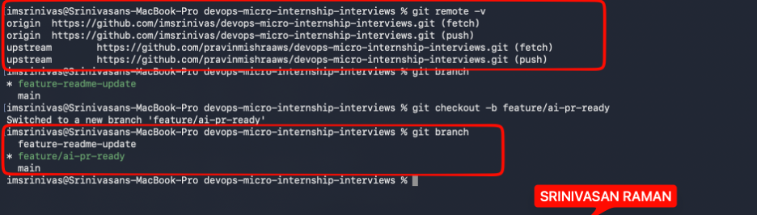

---

### Notes

**1. Why create a dedicated branch instead of doing this work on main?**

Working on a dedicated branch keeps main stable. Any changes, experiments, or mistakes stay isolated on feature/ai-pr-ready until the work is reviewed and ready to merge. It also makes the pull request cleaner — the diff shows only what's relevant to this task, nothing else.

---

# Task 1 — Stage a Change With Realistic Risk

## Goal

On your own fork of this repository (the one you've been submitting your DMI work in since onboarding), create a new branch and stage a change that a real reviewer should catch: a hardcoded-looking secret and a leftover debug statement.

### Evidence

#### Screenshot 1 — Output of  `git status` showing the staged file on feature/ai-pr-ready

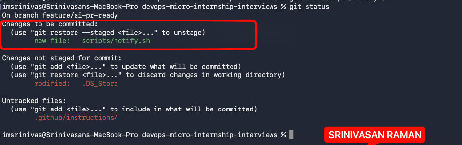

---

### Notes

**1. Why does this assignment use an obviously fake key instead of a real one?**

Because committing a real AWS key to a Git repository — even briefly — is a serious security risk. GitHub and other platforms scan for exposed credentials automatically, and real keys can be harvested and misused within seconds of being pushed. Using a clearly fake key demonstrates the concept safely without creating any actual exposure.

---

# Task 2 — Write a Real Git Pre-Commit Hook

## Goal

Create a tracked, shareable pre-commit hook that blocks a commit containing secret-like patterns or files over 1MB.

### Evidence

#### Screenshot 2 — `hooks/pre-commit` open in VS Code showing the full script

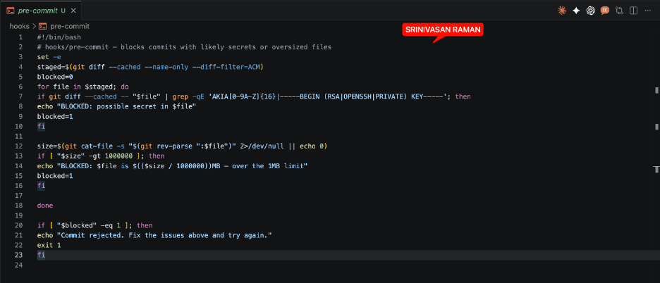

---

#### Screenshot 3 — Output of `git config core.hooksPath` confirming it points to `hooks`

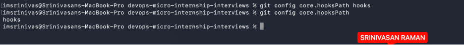

---

### Notes

**1. Why is `hooks/pre-commit` tracked in the repo instead of living only in `.git/hooks/`?**

Because .git/hooks/ is not tracked by Git — it's local only and doesn't get pushed or cloned. Storing the hook in hooks/pre-commit and pointing Git to it with git config core.hooksPath hooks means every contributor who clones the repo gets the same hook. It makes the protection consistent across the team rather than depending on each person to set it up manually

---

**2. Compare this to `PreToolUse` from Week 2 Assignment 6. What does each one intercept, and what do they have in common?**

PreToolUse Hook (Week 2 Assignment 6):
Intercepts dangerous Bash commands before execution

Pre-Commit Hook:
Intercepts secrets and sensitive data before commits are pushed

In Common:
Safety gates/guardrails — Both prevent irreversible or dangerous actions
Early Interception before the action completes.

---

# Task 3 — Prove the Hook Blocks the Risky Commit

## Goal

Attempt to commit the staged file from Task 1 and show the hook rejecting it.

### Evidence

#### Screenshot 4 — Terminal showing `git commit` rejected with the hook's "BLOCKED" message naming the exact file

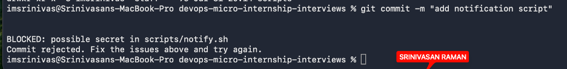

---

### Notes

**1. Which line in `hooks/pre-commit` matched your fake key, and why did it match?**

Check 1 — secret detection:

if git diff --cached -- "$file" | grep -qE 'AKIA[0-9A-Z]{16}|-----BEGIN (RSA|OPENSSH|PRIVATE) KEY-----'; then
    echo "BLOCKED: possible secret in $file"
    blocked=1
fi
The pattern AKIA[0-9A-Z]{16} matches AWS access key IDs (they always start with AKIA followed by 16 uppercase letters/numbers)

---

**2. Could this hook have caught a poorly-named variable that stores a secret without the `AKIA` prefix? What does that tell you about the limits of a fixed rule like this?**

The hook would miss all of these because:
    •No AKIA prefix
    •No -----BEGIN ... KEY----- header
    •They don't match the regex patterns

---

# Task 4 — Build the `/pr-ready` Skill

## Goal

Create a manually invoked Claude Code skill that reads your staged changes and produces a PR-readiness report and a draft PR description — without writing, committing, or pushing anything itself.

### Evidence

#### Screenshot 5 — `SKILL.md` frontmatter showing `allowed-tools: Bash, Read, Grep` (no `Write`) and `disable-model-invocation: true`

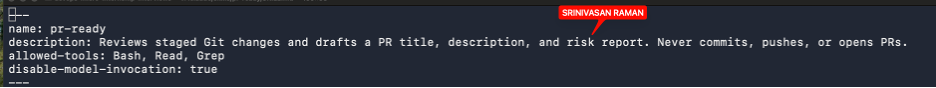

---

#### Screenshot 6 — `/pr-ready` output while the risky file is still staged, showing it flagged the secret and/or debug statement

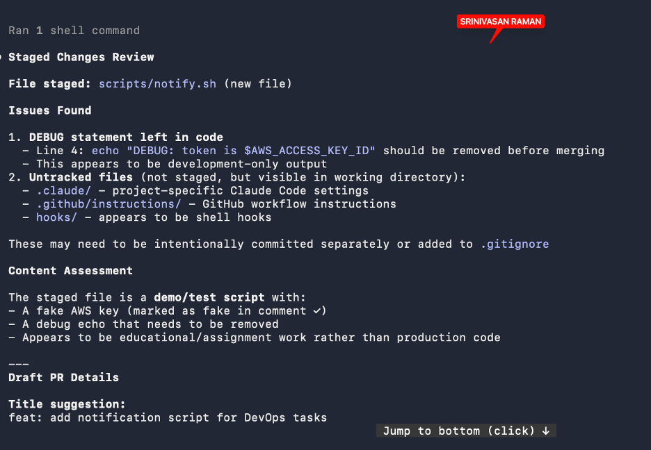

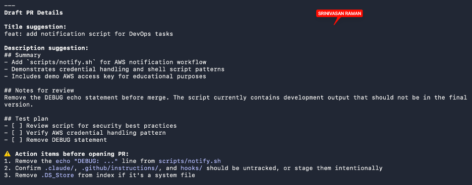

---

### Notes

**1. Why does `/pr-ready` have `Bash` and `Read` but not `Write`?**

Read (r) — Needed to:
•Examine the staged changes
•Check commit message format
•Inspect file contents for validation

Execute/Bash (x) — Needed to:
•Run the script itself
•Perform validation checks
•Exit with pass/fail status

Write (w) — NOT needed because:
•/pr-ready is a validation/check hook, not a modification hook
•It only reads state and reports problems
•It doesn't modify files, commit messages, or anything else

---

**2. The pre-commit hook and `/pr-ready` both looked at the same staged diff. Did they flag the same things? What did one catch that the other didn't?**

Issues Both Caught

1.DEBUG statement — Line 4: echo "DEBUG: token is $AWS_ACCESS_KEY_ID" in scripts/notify.sh
2.Untracked files — .env and .github/instructions that need to be handled

What Pre-Commit Caught That /pr-ready Didn't
•Specific line-level enforcement — Exact line number (4) with the offending code
•Hard blocking — "This appears to be development-only output"
•Direct rejection — Didn't let the commit go through

What /pr-ready Caught That Pre-Commit Didn't
•Context & purpose — Understood this is a "notification script for DevOps tasks"
•Environment distinction — Flagged that the script mixes test/production concerns
•PR readiness assessment — Provided draft title and description suggestions
•Higher-level guidance — "Script currently contains developer output that would not be in the final"
•Workflow perspective — Asked whether the PR is ready for review, not just technically valid

---

# Task 5 — Fix the Issues and Re-Verify

## Goal

Remove the secret and debug statement, then prove both gates now pass clean.

### Evidence

#### Screenshot 7 — `git commit` succeeding after the fix (no BLOCKED message)

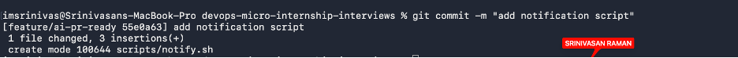

---

#### Screenshot 8 — Second `/pr-ready` run showing a clean risk report and a drafted PR title + description

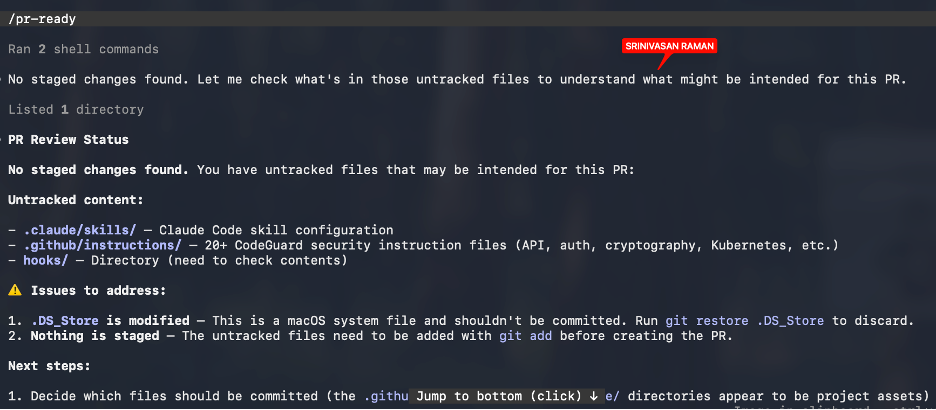

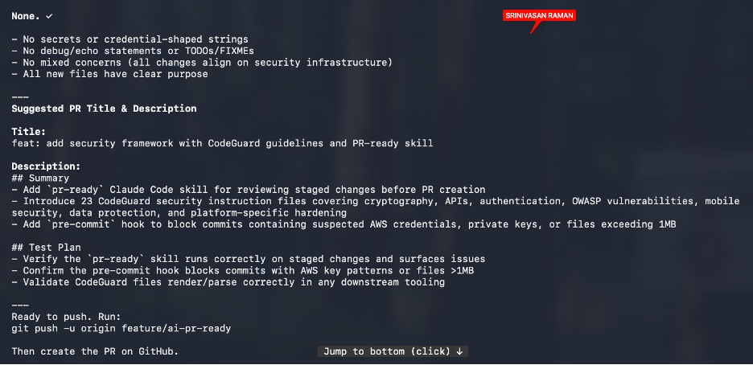

---

### Notes

**1. What exactly did you change to satisfy the pre-commit hook?**

AWS Credentials key has been deleted and no credentials are presents in the notify script which helped to satisfy pre-commit hook.

---

# Task 6 — Push and Open a Pull Request Using the AI Draft

## Goal

Push your branch and open a real Pull Request, using `/pr-ready`'s drafted title and description as your starting point — read it critically and edit before you use it.

**Important:** Open this Pull Request with base repository set to **your own fork** — not the shared upstream `pravinmishraaws/devops-micro-internship-pravinmishra` repository. This assignment's hook and skill files are your own practice work, not a change meant for the shared class repo.

### Evidence

#### Screenshot 9 — Your Pull Request showing the base repository is your own fork, plus the title and description, with the `/pr-ready` draft visible for comparison (paste it in the PR conversation or your notes below)

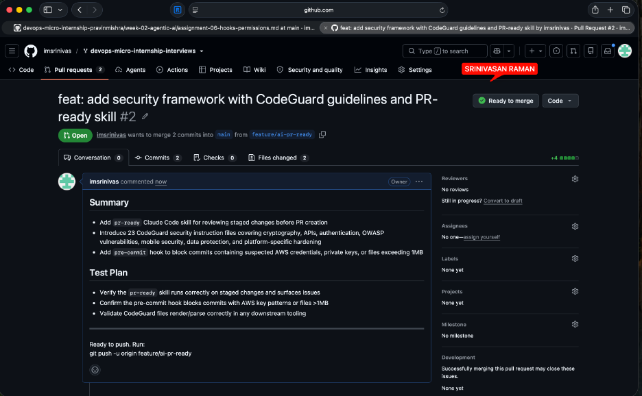

---

#### PR Link

https://github.com/imsrinivas/devops-micro-internship-interviews/pull/2

---

### Notes

**1. What, if anything, did you edit in the AI's drafted PR description before using it? Why?**

I used the pr-ready draft with minimal edits — my GitHub PR description matches the AI's suggestion almost word-for-word, just reformatted slightly for GitHub's markdown structure. The only meaningful change I made was condensing the headers and bullet points to fit GitHub's PR template. This suggests pr-ready generated sufficiently high-quality output that I didn't need to rewrite content, just accept and push

---

**2. If you had blindly copy-pasted the AI's draft without reading it, what could go wrong?**

If I had blindly copy-pasted without reading, I could have made false claims in the test plan (like "Validate CodeGuard files render/parse correctly") that I never actually tested, misleading reviewers into approving untested code. The AI might have hallucinated specific details about the 23 files or hook behavior that don't match reality, causing confusion during review. A polished but inaccurate PR description is worse than a rough one—it actively tricks reviewers into approving something they don't fully understand

---

**3. Why does this PR need to target your own fork instead of the shared upstream repository?**

I don't have write access to the shared upstream repository—only to my own fork. This is the standard GitHub workflow: I push changes to my fork, then open a PR requesting the maintainer to review and merge my changes into the official repository. It protects the upstream repo and ensures all contributions go through review.

---

# Task 7 — Map the Workflow to the Agentic Loop

## Goal

Explain this assignment's workflow using the same Gather → Analyze → Human Act → Verify structure from Week 3.

### Notes

**1. Which step(s) represent Gather?**

Pre-commit hook runs git diff --cached to gather staged changes. PR-ready skill reads those same staged changes to analyze

---

**2. Which step(s) represent Analyze?**

Pre-commit analyzes using fixed regex patterns to detect secrets, debug statements, and oversized files. PR-ready performs contextual analysis to generate PR title, description, test plan, and quality warnings

---

**3. Which step is Human Act, and why must a human — not Claude — run `git commit`, `git push`, and open the PR?**

developer must run git commit, git push, and open the PR because these are irreversible actions that permanently commit to the repository. Only a human can verify the AI's analysis is contextually correct before making permanent changes

---

**4. Which step is Verify?**

The Git Owner reviews the PR on GitHub and decides whether to approve/merge or request changes

---

**5. In one or two sentences: why do you need *both* the fixed-rule pre-commit hook and the AI skill? Isn't one enough?**

Pre-commit uses fixed rules to block obvious violations like secrets and debug code before commit. PR-ready uses AI context analysis to check overall quality and catch nuanced issues patterns can't detect. Together they provide layered defense.

---

# Task 8 — LinkedIn Post

## Goal

Publish a LinkedIn post summarizing what you built and what you learned about combining fixed-rule safety checks with AI-assisted review.

### Evidence

#### LinkedIn Post URL

---

## Key Learnings

Add 3-5 bullet points on what you learned this week.

-
-
-

---

# Submission Instructions

- Ensure `hooks/pre-commit` and `.claude/skills/pr-ready/SKILL.md` are committed to your GitHub repository
- Add all required screenshots to your submission
- All written answers must be in your own words
- Do not use a real secret or credential anywhere in your submission — the fake key in Task 1 is intentional and must stay clearly fake
- Open your Pull Request against your own fork, not the shared upstream repository
- Push your final changes to your forked repository
- Include your PR link and LinkedIn post URL

---

## GitHub Repository URL

Paste your forked repository URL here:

`https://github.com/imsrinivas/devops-micro-internship-interviews`

---

# Completion Checklist

- [ ] Branch `feature/ai-pr-ready` created with a staged file containing a fake secret and a debug statement
- [ ] `hooks/pre-commit` created and tracked in the repo (not only in `.git/hooks/`)
- [ ] `core.hooksPath` configured to point at `hooks/`
- [ ] Pre-commit hook shown blocking the risky commit
- [ ] `.claude/skills/pr-ready/SKILL.md` created with correct `allowed-tools` (no `Write`) and `disable-model-invocation: true`
- [ ] `/pr-ready` run against the risky diff and shown flagging issues
- [ ] Risky file fixed; `git commit` succeeds cleanly
- [ ] `/pr-ready` re-run showing a clean report and drafted PR title/description
- [ ] Pull Request opened using the AI draft as a starting point, with your own fork as the base repository (not upstream), PR link included
- [ ] Agentic Loop mapping (Task 7) completed in your own words
- [ ] LinkedIn post published and URL submitted
- [ ] All required screenshots added
- [ ] GitHub repository URL provided

---

## 📌 About DMI & CloudAdvisory

DevOps Micro Internship (DMI) is a project-based DevOps program run by Pravin Mishra (The CloudAdvisory) focused on real-world execution, systems thinking, and career readiness.

It helps learners build strong DevOps foundations with hands-on experience.

---

## 📌 Resources

- 🌐 DMI Official Website: https://dmi.pravinmishra.com?utm_source=github&utm_medium=readme  
- 🎓 University: https://university.pravinmishra.com?utm_source=github&utm_medium=readme  
- 💬 Discord Community: https://discord.pravinmishra.com?utm_source=github&utm_medium=readme  
- 📝 Blog: https://dmi.pravinmishra.com/blog?utm_source=github&utm_medium=readme  
- ▶️ YouTube Playlist: https://www.youtube.com/playlist?list=PLFeSNDtI4Cho  
- 🔗 Pravin Mishra (LinkedIn): https://www.linkedin.com/in/pravin-mishra-aws-trainer/  
- 🏢 CloudAdvisory (LinkedIn): https://www.linkedin.com/company/thecloudadvisory/

---

*This submission is part of DevOps Micro Internship (DMI) Cohort 3 — Agentic AI Track.*
