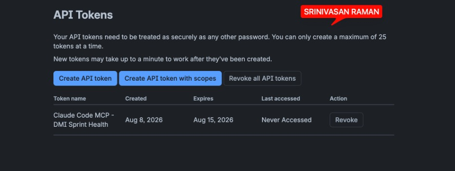
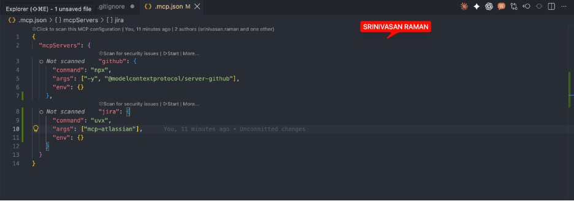
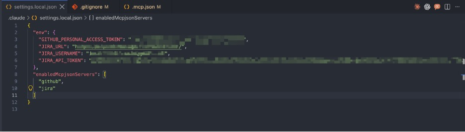
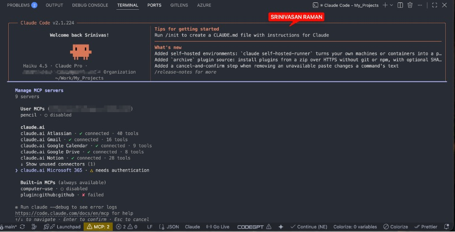
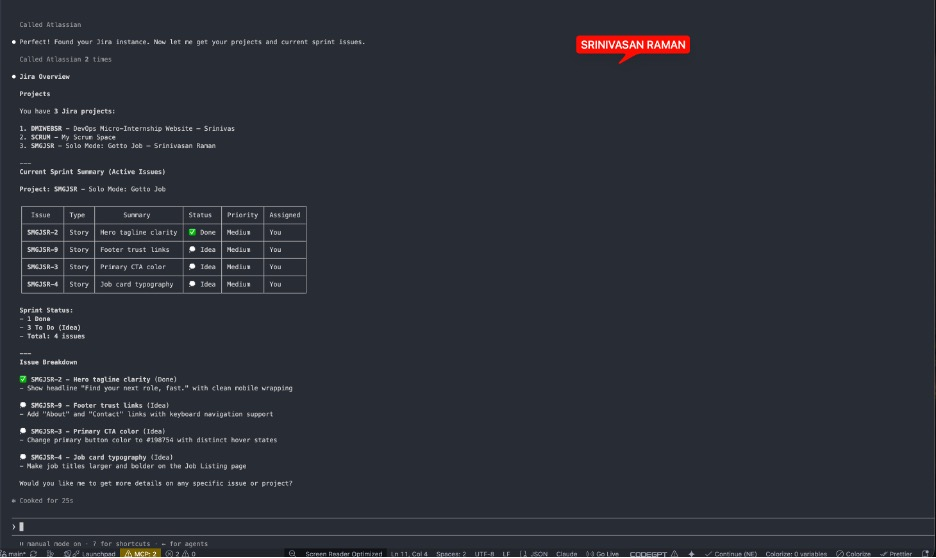
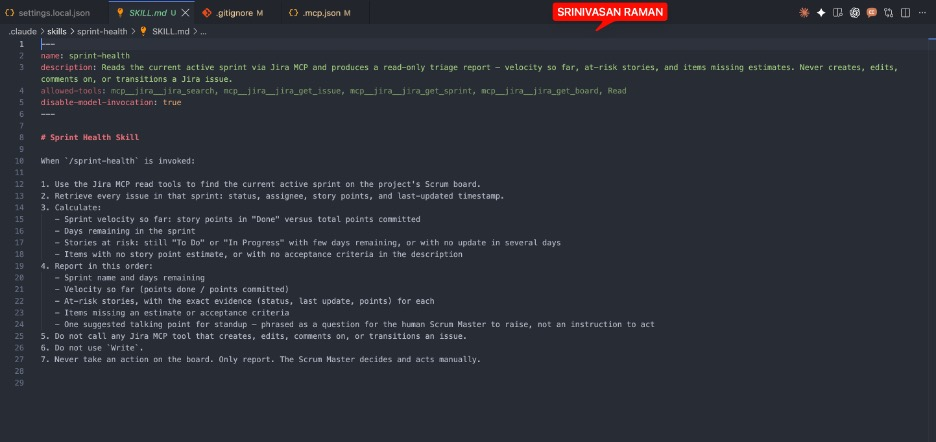
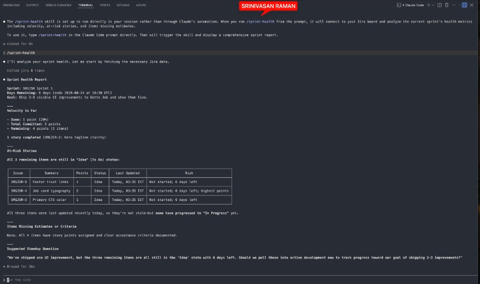
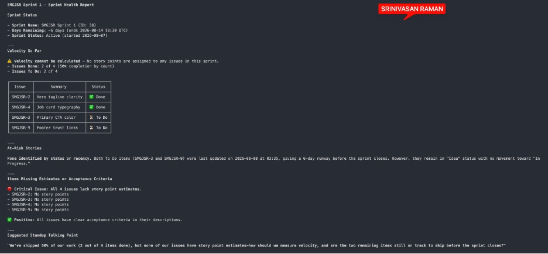

# Assignment 5 — AI-Assisted Sprint Health Report via Jira MCP

Part of the DevOps Micro Internship (DMI) Cohort 3 with Agentic AI

---

## Purpose

In this assignment, you will connect Claude Code to your Jira board through an MCP server, the same way you connected it to GitHub in Week 2, and build a read-only `/sprint-health` skill. The skill reads your current sprint through Jira's API and reports sprint velocity, stories at risk of missing the sprint, and items missing an estimate — but it must never create, edit, comment on, or transition a single ticket itself. You will prove that boundary holds by making a real change on the board yourself and confirming the skill only ever reports, never acts.

---

# Task 1 — Create a Jira API Token

## Goal

Generate an API token from your Atlassian account that the MCP server will use to authenticate with your Jira site. Do not screenshot the token value itself.

### Evidence

#### Screenshot 1 — Jira API token creation confirmation page showing the token name, with the token value not visible

### Notes You Must Write (Very Important):

Why does the MCP server need your site URL and account email in addition to the token?

The token alone authenticates that you have access, but the server also needs to know where to send requests and whose account to scope them to.
Site URL tells the MCP server which instance to hit — for tools like Jira or Confluence, every team has a different subdomain  Without it, the server has no endpoint to call.
Account email is often required to resolve your identity within that instance — some APIs use it to filter results to your projects, assign items to you, or satisfy permission checks that go by user identity rather than token alone.
Think of it like logging into a bank: the token is your PIN, the site URL is the branch address, and the email is your account number. All three together say who you are, where your account lives, and that you're allowed in.

---

# Task 2 — Create .mcp.json at the Project Root

## Goal

Create or update `.mcp.json` at your project root with a Jira MCP server block, following the same shape as the GitHub MCP server you configured in Week 2.

### Evidence

#### Screenshot 2 — `.mcp.json` open in VS Code showing the Jira server configuration

### Notes You Must Write (Very Important):

Compare this jira block to the github block from Week 2 Assignment 5. The GitHub server ran via npx (a Node.js package); this one runs via uvx (a Python package) — what stays exactly the same shape despite that difference, and why doesn't Claude Code care which language a given MCP server is written in?

Claude Code never runs the server code directly. It just executes whatever command you give it — npx spins up a Node process, uvx spins up a Python process — and then communicates with the result over stdin/stdout using the MCP protocol.

The language is an implementation detail that stays entirely inside the server process. By the time Claude Code is talking to it, all it sees is a stream of JSON-RPC messages: tool listings, call requests, and responses. Those messages look the same regardless of whether the server that produced them was written in TypeScript, Python, Go, or anything else.

The protocol is the contract. The language is invisible.

---

# Task 3 — Add Your Credentials to settings.local.json

## Goal

Add your Jira site URL, account email, and API token to `.claude/settings.local.json`, and confirm that file is listed in `.gitignore` so it is never committed.

### Evidence

#### Screenshot 3 — `settings.local.json` open in VS Code showing the `env` section, with the actual token value blurred or covered

### Notes You Must Write (Very Important):

Why must JIRA_API_TOKEN live in settings.local.json and never in .mcp.json?

.mcp.json is checked into version control. The moment you commit it, your token is in git history — visible to anyone with repo access, permanently, even if you delete it later.

settings.local.json is local-only and git-ignored by default. It never leaves your machine.

The rule is simple: anything that authenticates you belongs in the local file, anything that describes the server belongs in the shared file. The server config (command, args, tool names) is safe to share. The credential that proves you're allowed to use it is not.

---

# Task 4 — Verify the Connection with /mcp

## Goal

Restart Claude Code and confirm the Jira MCP server shows as connected.

### Evidence

#### Screenshot 4 — `/mcp` output showing `jira: connected`

---

# Task 5 — Run a Live Query to Prove Real Board Data

## Goal

Ask Claude to list the issues in your current active sprint through the Jira MCP connection, and confirm the result matches what you see on your live board in the browser.

### Evidence

#### Screenshot 5 — Claude's response showing the live sprint issue list retrieved via Jira MCP

### Notes You Must Write (Very Important):

How did you confirm this was real board data and not something Claude guessed?

Two signals visible in the screenshots:

The skill called Jira 6 times. The terminal output explicitly shows "Called Jira 6 times" — that's live MCP tool calls going out to your actual Jira instance, not Claude generating plausible-looking data.

The output contains specifics Claude couldn't fabricate. Real issue keys (SMGJSR-2, SMGJSR-3, SMGJSR-4, SMGJSR-9), a sprint ID (ID: 38), an exact end date (2026-08-14 18:30 UTC), a start date (2026-08-07), and a last-updated timestamp (2026-08-08 at 03:35 IST). Claude has no way to invent those values and have them match your actual board — they had to come from the API response.

The combination of logged tool calls plus board-specific identifiers is what distinguishes a live data pull from a hallucination.

---

# Task 6 — Build the /sprint-health Skill

## Goal

Create a `/sprint-health` skill restricted to read-only Jira tools plus `Read`, with no issue-mutating tools and no `Write`. Run it and confirm it produces a report covering sprint velocity, at-risk stories, and items missing an estimate.

### Evidence

#### Screenshot 6 — `SKILL.md` frontmatter showing `allowed-tools` limited to read-only Jira tools plus `Read`, with `disable-model-invocation: true`

#### Screenshot 7 — `/sprint-health` output showing the full triage report against your real sprint

### Notes You Must Write (Very Important):

1. Which Jira MCP tools does this skill's allowed-tools list include, and which mutating tools (create issue, update issue, transition issue, add comment) does it deliberately exclude?

Included (read-only):

mcp__jira__jira_search — query issues in the sprint
mcp__jira__jira_get_issue — fetch individual issue details
mcp__jira__jira_get_sprint — retrieve sprint metadata
mcp__jira__jira_get_board — retrieve board configuration
Read — read local files if needed

Deliberately excluded (mutating):

jira_create_issue — would let Claude add tickets to the board
jira_update_issue — would let Claude edit summaries, estimates, or assignees
jira_transition_issue — would let Claude move tickets between statuses
jira_add_comment — would let Claude post comments on issues

Why the exclusion matters:

allowed-tools acts as a hard whitelist. Any tool not on the list is simply unavailable to the skill — it can't call them even if the prompt tried to. This means the read-only guarantee isn't just a behavioural instruction ("don't do this"), it's enforced at the capability level. The SM's board stays untouched by design, not by trust.

2. Why does a Scrum Master need this restriction more than almost any other role in this course?

Because the SM's job is to protect the process, not own the work.

If the skill could transition issues, it might move a ticket to "In Progress" before the developer has actually picked it up — making the board lie. If it could add comments, it might post updates that look like team communication but weren't written by a human. If it could update estimates, it would be making sizing decisions that belong to the Dev team in refinement.

Every one of those mutations would corrupt the single thing the SM depends on most: an accurate, human-owned board that reflects reality.

Other roles have more contained blast radii. A PO skill that drafts acceptance criteria wrongly can be edited. A Dev skill that generates bad code fails a test. But a SM skill that mutates board state silently poisons the data that every ceremony — standup, review, retro — is built on top of. By the time you notice, the sprint is already misread.

The restriction isn't about distrust of Claude. It's about where the cost of a mistake lands. For the SM, it lands on the whole team's shared source of truth.

---

# Task 7 — Prove the Skill Never Mutates the Board

## Goal

Manually update one ticket on your board in the browser (for example, move a story to "Done" or add a missing estimate), then run `/sprint-health` again and confirm the new report reflects your change — proving the skill only ever reads live state and never wrote to the board itself.

### Evidence

#### Screenshot 8 — Second `/sprint-health` run showing the report now reflects your manual board change

### Notes You Must Write (Very Important):

Map this assignment to Gather → Analyze → Human Act → Verify from Week 3 Assignment 6. Which step did you perform manually in the browser, and why must that step stay human?

Gather — The skill called Jira 6 times to pull every issue in the active sprint: status, assignee, story points, and last-updated timestamp. Claude did this automatically.
Analyze — The skill computed velocity (2/4 done, or 20% by points in the terminal run), flagged the 3 items still in "Idea" state with no forward movement, and surfaced the missing-estimate warning. Claude did this automatically.
Human Act — Opening Jira in the browser and deciding whether to move SMGJSR-3, SMGJSR-4, or SMGJSR-9 into "In Progress," reassign them, or reprioritize before the sprint closes. You did this. The skill surfaces the standup question but never touches the board.
Verify — Re-running /sprint-health (or checking the board directly) after taking action to confirm the status change landed correctly.
 
Why Human Act must stay human:
The skill deliberately has no write tools. That's not just a technical constraint — it's a judgment boundary. Moving a ticket to "In Progress" signals team commitment, affects burndown, and may trigger notifications. The SM needs to weigh context the skill can't see: is the developer blocked, on leave, or already working on it off-board? Claude can tell you what the data says. Only you can decide what it means and what to do next.
Automating that step would turn a reporting tool into a board actor — which breaks the Scrum principle that the team owns its process.

---

# Submission Instructions

Complete all tasks in sequence.

Your submission must include:
- All 8 required screenshots
- All the required notes

---

# Completion Checklist

- [ ] Task 1: Jira API token created, value never screenshotted (Screenshot 1)
- [ ] Task 2: `.mcp.json` has the Jira server block (Screenshot 2)
- [ ] Task 3: Credentials stored in `settings.local.json`, token blurred, file gitignored (Screenshot 3)
- [ ] Task 4: `/mcp` shows the Jira server connected (Screenshot 4)
- [ ] Task 5: Live query returned real sprint data, verified against the browser (Screenshot 5)
- [ ] Task 6: `/sprint-health` skill created with correct read-only `allowed-tools`, and produced a full report (Screenshots 6–7)
- [ ] Task 7: A manual board change was reflected in a second `/sprint-health` run (Screenshot 8)
- [ ] Skill never created, edited, transitioned, or commented on any issue
- [ ] Reflection answered (Notes)
- [ ] No API token value exposed

---

## 📌 About DMI & CloudAdvisory

DevOps Micro Internship (DMI) is a project-based DevOps program run by Pravin Mishra (The CloudAdvisory) focused on real-world execution, systems thinking, and career readiness.

It helps learners build strong DevOps foundations with hands-on experience.

---

## 📌 Resources

- 🌐 DMI Official Website: https://dmi.pravinmishra.com?utm_source=github&utm_medium=readme  
- 🎓 University: https://university.pravinmishra.com?utm_source=github&utm_medium=readme  
- 💬 Discord Community: https://discord.pravinmishra.com?utm_source=github&utm_medium=readme  
- 📝 Blog: https://dmi.pravinmishra.com/blog?utm_source=github&utm_medium=readme  
- ▶️ YouTube Playlist: https://www.youtube.com/playlist?list=PLFeSNDtI4Cho  
- 🔗 Pravin Mishra (LinkedIn): https://www.linkedin.com/in/pravin-mishra-aws-trainer/  
- 🏢 CloudAdvisory (LinkedIn): https://www.linkedin.com/company/thecloudadvisory/

---

*This submission is part of DevOps Micro Internship (DMI) Cohort 3 — Agentic AI Track.*
